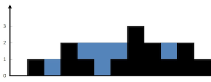
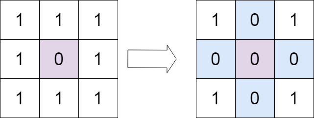
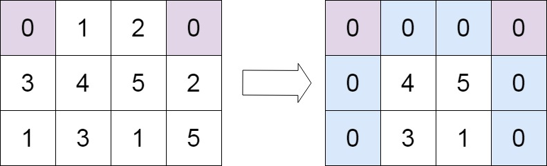
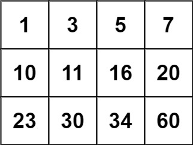
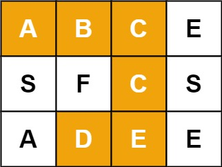

# leetcode
## 31. 下一个排列（技巧）
整数数组的一个 排列  就是将其所有成员以序列或线性顺序排列。

    例如，arr = [1,2,3] ，以下这些都可以视作 arr 的排列：[1,2,3]、[1,3,2]、[3,1,2]、[2,3,1] 。

整数数组的 下一个排列 是指其整数的下一个字典序更大的排列。更正式地，如果数组的所有排列根据其字典顺序从小到大排列在一个容器中，那么数组的 下一个排列 就是在这个有序容器中排在它后面的那个排列。如果不存在下一个更大的排列，那么这个数组必须重排为字典序最小的排列（即，其元素按升序排列）。

    例如，arr = [1,2,3] 的下一个排列是 [1,3,2] 。
    类似地，arr = [2,3,1] 的下一个排列是 [3,1,2] 。
    而 arr = [3,2,1] 的下一个排列是 [1,2,3] ，因为 [3,2,1] 不存在一个字典序更大的排列。

给你一个整数数组 nums ，找出 nums 的下一个排列。

必须 原地 修改，只允许使用额外常数空间。

示例 1：

输入：nums = [1,2,3]
输出：[1,3,2]

示例 2：

输入：nums = [3,2,1]
输出：[1,2,3]

示例 3：

输入：nums = [1,1,5]
输出：[1,5,1]

 

提示：

    1 <= nums.length <= 100
    0 <= nums[i] <= 100

```
class Solution {
public:
    void nextPermutation(vector<int>& nums) {
        //从右向左找，找最后一个较小值
        int i = nums.size() - 2;
        while (i >= 0 && nums[i] >= nums[i + 1]) {
            i--;
        }
        
       //从右向左找，找最小的较大值
        if (i >= 0) {
            int j = nums.size() - 1;
            while (j >= 0 && nums[i] >= nums[j]) {
                j--;
            }
            swap(nums[i], nums[j]);
        }
        
        //颠倒i后面的
        for(int k = i + 1; k < (nums.size() - i - 1) / 2; k++)
        {
            swap(i + 1 + k, nums.size() -1 - k);
        }
    }
};
```


## 33. 搜索旋转排序数组（二分）

整数数组 nums 按升序排列，数组中的值 互不相同 。
在传递给函数之前，nums 在预先未知的某个下标 k（0 <= k < nums.length）上进行了 旋转，使数组变为 [nums[k], nums[k+1], ..., nums[n-1], nums[0], nums[1], ..., nums[k-1]]（下标 从 0 开始 计数）。例如， [0,1,2,4,5,6,7] 在下标 3 处经旋转后可能变为 [4,5,6,7,0,1,2] 。
给你 旋转后 的数组 nums 和一个整数 target ，如果 nums 中存在这个目标值 target ，则返回它的下标，否则返回 -1 。

示例 1：
输入：nums = [4,5,6,7,0,1,2], target = 0
输出：4

示例 2：
输入：nums = [4,5,6,7,0,1,2], target = 3
输出：-1

示例 3：
输入：nums = [1], target = 0
输出：-1
提示：

    1 <= nums.length <= 5000
    -10^4 <= nums[i] <= 10^4
    nums 中的每个值都 独一无二
    题目数据保证 nums 在预先未知的某个下标上进行了旋转
    -10^4 <= target <= 10^4

进阶：你可以设计一个时间复杂度为 O(log n) 的解决方案吗？

```
class Solution {
public:
    int search(vector<int>& nums, int target) {
        int n = (int)nums.size();
        if (!n) {
            return -1;
        }
        if (n == 1) {
            return nums[0] == target ? 0 : -1;
        }
        int l = 0, r = n - 1;
        while (l <= r) {
            int mid = (l + r) / 2;
            if (nums[mid] == target) return mid;
            // 左边有序
            if (nums[0] <= nums[mid]) {
                if (nums[0] <= target && target < nums[mid]) {
                    r = mid - 1;
                } else {
                    l = mid + 1;
                }
                
            //右边有序
            } else {
                if (nums[mid] < target && target <= nums[n - 1]) {
                    l = mid + 1;
                } else {
                    r = mid - 1;
                }
            }
        }
        return -1;
    }
};
```


## 34. 在排序数组中查找元素的第一个和最后一个位置（二分）
给定一个按照升序排列的整数数组 nums，和一个目标值 target。找出给定目标值在数组中的开始位置和结束位置。
如果数组中不存在目标值 target，返回 [-1, -1]。

进阶：

    你可以设计并实现时间复杂度为 O(log n) 的算法解决此问题吗？
示例 1：
输入：nums = [5,7,7,8,8,10], target = 8
输出：[3,4]

示例 2：
输入：nums = [5,7,7,8,8,10], target = 6
输出：[-1,-1]

示例 3：
输入：nums = [], target = 0
输出：[-1,-1]

```
class Solution { 
public:
    int binarySearch(vector<int>& nums, int target, bool lower) {
        int left = 0, right = (int)nums.size() - 1, ans = (int)nums.size();
        while (left <= right) {
            int mid = (left + right) / 2;
            if (nums[mid] > target || (lower && nums[mid] >= target)) {
                right = mid - 1;
                ans = mid;
            } else {
                left = mid + 1;
            }
        }
        return ans;
    }

    vector<int> searchRange(vector<int>& nums, int target) {
        int leftIdx = binarySearch(nums, target, true);
        int rightIdx = binarySearch(nums, target, false) - 1;
        if (leftIdx <= rightIdx && rightIdx < nums.size() && nums[leftIdx] == target && nums[rightIdx] == target) {
            return vector<int>{leftIdx, rightIdx};
        } 
        return vector<int>{-1, -1};
    }
};
```

## 35. 搜索插入位置（二分）
给定一个排序数组和一个目标值，在数组中找到目标值，并返回其索引。如果目标值不存在于数组中，返回它将会被按顺序插入的位置。
请必须使用时间复杂度为 O(log n) 的算法。

示例 1:
输入: nums = [1,3,5,6], target = 5
输出: 2

示例 2:
输入: nums = [1,3,5,6], target = 2
输出: 1

示例 3:
输入: nums = [1,3,5,6], target = 7
输出: 4

示例 4:
输入: nums = [1,3,5,6], target = 0
输出: 0

示例 5:
输入: nums = [1], target = 0
输出: 0

```
class Solution {
public:
    int searchInsert(vector<int>& nums, int target) {
        int n = nums.size();
        int left = 0, right = n - 1, ans = n;
        while (left <= right) {
            int mid = ((right - left) >> 1) + left;
            if (target <= nums[mid]) {
                ans = mid;
                right = mid - 1;
            } else {
                left = mid + 1;
            }
        }
        return ans;
    }
};
```

## 36.有效的数独（回溯）
请你判断一个 9 x 9 的数独是否有效。只需要 根据以下规则 ，验证已经填入的数字是否有效即可。

    数字 1-9 在每一行只能出现一次。
    数字 1-9 在每一列只能出现一次。
    数字 1-9 在每一个以粗实线分隔的 3x3 宫内只能出现一次。（请参考示例图）
注意：

    一个有效的数独（部分已被填充）不一定是可解的。
    只需要根据以上规则，验证已经填入的数字是否有效即可。
    空白格用 '.' 表示。
示例 1：
输入：board = 
[["5","3",".",".","7",".",".",".","."]
,["6",".",".","1","9","5",".",".","."]
,[".","9","8",".",".",".",".","6","."]
,["8",".",".",".","6",".",".",".","3"]
,["4",".",".","8",".","3",".",".","1"]
,["7",".",".",".","2",".",".",".","6"]
,[".","6",".",".",".",".","2","8","."]
,[".",".",".","4","1","9",".",".","5"]
,[".",".",".",".","8",".",".","7","9"]]
输出：true

示例 2：
输入：board = 
[["8","3",".",".","7",".",".",".","."]
,["6",".",".","1","9","5",".",".","."]
,[".","9","8",".",".",".",".","6","."]
,["8",".",".",".","6",".",".",".","3"]
,["4",".",".","8",".","3",".",".","1"]
,["7",".",".",".","2",".",".",".","6"]
,[".","6",".",".",".",".","2","8","."]
,[".",".",".","4","1","9",".",".","5"]
,[".",".",".",".","8",".",".","7","9"]]
输出：false
解释：除了第一行的第一个数字从 5 改为 8 以外，空格内其他数字均与 示例1 相同。 但由于位于左上角的 3x3 宫内有两个 8 存在, 因此这个数独是无效的。
```
class Solution {
public:
    bool isValidSudoku(vector<vector<char>>& board) {
        int rows[9][9];
        int columns[9][9];
        int subboxes[3][3][9];
        
        memset(rows,0,sizeof(rows));
        memset(columns,0,sizeof(columns));
        memset(subboxes,0,sizeof(subboxes));
        for (int i = 0; i < 9; i++) {
            for (int j = 0; j < 9; j++) {
                char c = board[i][j];
                if (c != '.') {
                    int index = c - '0' - 1;
                    rows[i][index]++;
                    columns[j][index]++;
                    subboxes[i / 3][j / 3][index]++;
                    if (rows[i][index] > 1 || columns[j][index] > 1 || subboxes[i / 3][j / 3][index] > 1) {
                        return false;
                    }
                }
            }
        }
        return true;
    }
};
```


## 37.解数独(递归回溯)

编写一个程序，通过填充空格来解决数独问题。

数独的解法需 遵循如下规则：

    数字 1-9 在每一行只能出现一次。
    数字 1-9 在每一列只能出现一次。
    数字 1-9 在每一个以粗实线分隔的 3x3 宫内只能出现一次。（请参考示例图）

数独部分空格内已填入了数字，空白格用 '.' 表示。


```
//本地使用递归回溯的方法

class Solution
{
private:
    bool m_abRaw[9][9];
    bool m_abCol[9][9];
    bool m_abBlock[3][3][9];
    vector<pair<int, int>> m_stepVect;
    
    bool m_bFlag;

public:
    void dfs(vector<vector<char>>& board, int step)
    {
        //递归成功，退出
        if(step == m_stepVect.size())
        {
            m_bFlag = true;
            return;
        }
        
        // 尝试所有可能
        auto [i ,j] = m_stepVect[step];
        for(int digit = 0; digit < 9 && !m_bFlag; digit++)
        {
            // 可以进入
            if(!m_abRaw[i][digit] && !m_abCol[j][digit] && !m_abBlock[i / 3][j / 3][digit])
            {
                m_abRaw[i][digit] = m_abCol[j][digit] = m_abBlock[i / 3][j / 3][digit] = true;
                board[i][j] = digit + '0' + 1;
                dfs(board, step + 1);
                m_abRaw[i][digit] = m_abCol[j][digit] = m_abBlock[i / 3][j / 3][digit] = false;
            }
        }
    };
    
    void solveSudoku(vector<vector<char>>& board) 
    {
        // 递归前的准备，标记回溯，准备递归步骤
        memset(m_abRaw, false, sizeof(m_abRaw));
        memset(m_abCol, false, sizeof(m_abCol));
        memset(m_abBlock, false, sizeof(m_abBlock));
        m_bFlag = false;
    
        for(int i = 0; i < 9; i++)
        {
            for(int j = 0; j < 9; j++)
            {
                if(board[i][j] == '.')
                {
                    m_stepVect.emplace_back(i, j);
                }
                else
                {
                    int iDigit = board[i][j] - '0' - 1;
                    m_abRaw[i][iDigit] = m_abCol[j][iDigit] = m_abBlock[i / 3][j / 3][iDigit] = true;
                }
            }
        }
    
        // 开始递归
        dfs(board, 0);
        return;
    }
};
```

## 39. 组合总和（回溯）
给你一个 无重复元素 的整数数组 candidates 和一个目标整数 target ，找出 candidates 中可以使数字和为目标数 target 的 所有 不同组合 ，并以列表形式返回。你可以按 任意顺序 返回这些组合。
candidates 中的 同一个 数字可以 无限制重复被选取 。如果至少一个数字的被选数量不同，则两种组合是不同的。 
对于给定的输入，保证和为 target 的不同组合数少于 150 个。

示例 1：

输入：candidates = [2,3,6,7], target = 7
输出：[[2,2,3],[7]]
解释：
2 和 3 可以形成一组候选，2 + 2 + 3 = 7 。注意 2 可以使用多次。
7 也是一个候选， 7 = 7 。
仅有这两种组合。

示例 2：
输入: candidates = [2,3,5], target = 8
输出: [[2,2,2,2],[2,3,3],[3,5]]

示例 3：
输入: candidates = [2], target = 1
输出: []

```
// 本题使用回溯剪枝的算法
class Solution {
private:
    vector<int> m_candidateVect;
    vector<vector<int>> m_resultVect;
public:

    void dfs(vector<int> &curVect, int cur, int target)
    {
        //终止条件，target==0
        if(target == 0)
        {
            m_resultVect.push_back(curVect);
            return;
        }
        if(target < 0)
        {
            return;
        }
        for(int i = 0; i < m_candidateVect.size(); i++)
        {
            if(m_candidateVect[i] >= curDigit)
            {
                // 进入
                curVect.push_back(m_candidateVect[i]);
            
                dfs(curVect, m_candidateVect[i], target - m_candidateVect[i]);   //注意会小于0
                // 退出
                curVect.pop_back();
            }
        }
    }
    
    vector<vector<int>> combinationSum(vector<int>& candidates, int target)
    {
        //准备回溯步骤
        m_candidateVect = candidates;
        
        vector<int> curVect;
        // 考虑终止条件：等于target
        dfs(curVect, 0, target);
        
        return m_resultVect;
    }
};
```

## 40. 组合总和 II（回溯）
给定一个候选人编号的集合 candidates 和一个目标数 target ，找出 candidates 中所有可以使数字和为 target 的组合。
candidates 中的每个数字在每个组合中只能使用 一次 。
注意：解集不能包含重复的组合。 

 

示例 1:
输入: candidates = [10,1,2,7,6,1,5], target = 8,
输出:
[
[1,1,6],
[1,2,5],
[1,7],
[2,6]
]

示例 2:
输入: candidates = [2,5,2,1,2], target = 5,
输出:
[
[1,2,2],
[5]
]

```
class Solution {
private:
    vector<int> m_candidateVect;
    vector<vector<int>> m_resultVect;
public:
    //当前结果，候选列表中的当前下标(避免一个组合的不同排列)，所剩目标
    void dfs(vector<int> &curVect, int curIndex, int target)
    {
        //成功终止条件，target==0
        if(target == 0)
        {
            m_resultVect.push_back(curVect);
            return;
        }
        //失败终止条件
        if(target < 0)
        {
            return;
        }
        for(int i = curIndex; i < m_candidateVect.size(); i++)
        {
            if(true)
            {
                if (i > curIndex && m_candidateVect[i] == m_candidateVect[i - 1])
                    continue;
                // 进入
                curVect.push_back(m_candidateVect[i]);

                dfs(curVect, i + 1, target - m_candidateVect[i]);   //注意会小于0
                // 退出
                curVect.pop_back();
            }
        }
    }
    
    vector<vector<int>> combinationSum2(vector<int>& candidates, int target)
    {
        //准备回溯步骤
        m_candidateVect = candidates;
        sort(m_candidateVect.begin(), m_candidateVect.end());
        
        vector<int> curVect;
        // 考虑终止条件：等于target
        dfs(curVect, 0, target);
        
        return m_resultVect;
    }
};
```

## 41. 缺失的第一个正数(哈希)

给你一个未排序的整数数组 nums ，请你找出其中没有出现的最小的正整数。
请你实现时间复杂度为 O(n) 并且只使用常数级别额外空间的解决方案。

示例 1：
输入：nums = [1,2,0]
输出：3

示例 2：
输入：nums = [3,4,-1,1]
输出：2

示例 3：
输入：nums = [7,8,9,11,12]
输出：1

```
class Solution {
public:
    int firstMissingPositive(vector<int>& nums) {
        int n = nums.size();
        int i = 0;
        // 答案最大为n+1        

        // 负数不可能为答案，都置为n+1
        for(i = 0; i < n; i++)
        {
            if(nums[i] <= 0)
            {
                nums[i] = n + 1;
            }
        }
        
        // 如果当前值0 < x <= n，将以x - 1为下标的值置负
        for(i = 0; i < n; i++)
        {
            if(1 <= abs(nums[i]) && abs(nums[i]) <= n)
            {
                nums[abs(nums[i]) - 1] = -abs(nums[abs(nums[i]) - 1]);
            }
        }
        
        // 遇到第一个非负数说明该下标没有对应的值，返回x+1
        
        for(i = 0; i < n; i++)
        {
            if(nums[i] > 0)
            {
                return i + 1;
            }
        }
        
        return n + 1;
    }
};
```

## 42. 接雨水（动态规划）

给定 n 个非负整数表示每个宽度为 1 的柱子的高度图，计算按此排列的柱子，下雨之后能接多少雨水。


示例1：
输入：height = [0,1,0,2,1,0,1,3,2,1,2,1]
输出：6
解释：上面是由数组 [0,1,0,2,1,0,1,3,2,1,2,1] 表示的高度图，在这种情况下，可以接 6 个单位的雨水（蓝色部分表示雨水）。 

```
// 考虑使用动态规划做记录
class Solution {
public:
    int trap(vector<int>& height) {
        int n = height.size();
        int *maxLeft = new int[n];
        int *maxRight = new int[n];
        maxLeft[0] = height[0];
        maxRight[n-1] = height[n-1];
        for(int i = 1; i < n; i++)
        {
            maxLeft[i] = max(maxLeft[i - 1], height[i]);
        }
        for(int i = n - 2; i >= 0; i--)
        {
            maxRight[i] = max(maxRight[i + 1], height[i]);
        }
        
        int ans = 0;
        for(int i = 0; i < n; i++)
        {
            ans += min(maxLeft[i], maxRight[i]) - height[i];
        }
        delete [] maxLeft;
        delete [] maxRight;
        return ans;
    }
};

```

## 45. 跳跃游戏 II(动态规划，贪心两种)
给你一个非负整数数组 nums ，你最初位于数组的第一个位置。
数组中的每个元素代表你在该位置可以跳跃的最大长度。
你的目标是使用最少的跳跃次数到达数组的最后一个位置。
假设你总是可以到达数组的最后一个位置。
示例 1:
输入: nums = [2,3,1,1,4]
输出: 2
解释: 跳到最后一个位置的最小跳跃数是 2。
     从下标为 0 跳到下标为 1 的位置，跳 1 步，然后跳 3 步到达数组的最后一个位置。

示例 2:
输入: nums = [2,3,0,1,4]
输出: 2
```
//动态规划
class Solution {
public:
    int jump(vector<int>& nums) {
        int n = nums.size();
        vector<int> dp(n);
        int start = 0;
        for(int i = 1; i<n; ++i){
            for(int j = start; j<i; ++j){
                if(j+nums[j]>=i){
                    start = j;
                    dp[i] = dp[j] + 1;
                    break;
                }
            }
        }
        return dp[n-1];
    }
};
```

```
//贪心
class Solution {
public:
    int jump(vector<int>& nums) {
        int maxPos = 0, n = nums.size(), end = 0, step = 0;
        for (int i = 0; i < n - 1; ++i) 
        {
            if (maxPos >= i) 
            {
                maxPos = max(maxPos, i + nums[i]);
                // 到达边界时，更新边界并将跳跃次数增加 1
                if (i == end) 
                {
                    end = maxPos;
                    ++step;
                }
            }
        }
        return step;
    }
};
```

## 46. 全排列(回溯)
给定一个不含重复数字的数组 nums ，返回其 所有可能的全排列 。你可以 按任意顺序 返回答案。
示例 1：
输入：nums = [1,2,3]
输出：[[1,2,3],[1,3,2],[2,1,3],[2,3,1],[3,1,2],[3,2,1]]

示例 2：
输入：nums = [0,1]
输出：[[0,1],[1,0]]

示例 3：
输入：nums = [1]
输出：[[1]]
```
//标记容器可以优化，使用nums即可，curIndex左边为填过的数，右边为未填的数
class Solution {
private:
    vector<vector<int>> m_ansVect;
    vector<int> m_nums;
public:
    void dfs(vector<int>&CurVect, vector<bool>& flagVect, int curIndex)
    {
        // 递归结束
        if(curIndex == flagVect.size())
        {
            m_ansVect.push_back(CurVect);
            return;
        }
        
        for(int i = 0; i < m_nums.size(); i++)
        {
            if(flagVect[i])
            {
                continue;
            }
            CurVect.push_back(m_nums[i]);
            flagVect[i] = true;
            dfs(CurVect, flagVect, curIndex + 1);
            flagVect[i] = false;
            CurVect.pop_back();
            
        }
    }
    vector<vector<int>> permute(vector<int>& nums) {
        // 递归前的准备
        vector<int> CurVect;
        m_nums = nums;
        vector<bool> flagVect(nums.size(), false);
        
        // 回溯
        dfs(CurVect, flagVect, 0);
        return m_ansVect;
    }
};
```

## 47. 全排列 II
给定一个可包含重复数字的序列 nums ，按任意顺序 返回所有不重复的全排列。

示例 1：
输入：nums = [1,1,2]
输出：
[[1,1,2],
 [1,2,1],
 [2,1,1]]

示例 2：
输入：nums = [1,2,3]
输出：[[1,2,3],[1,3,2],[2,1,3],[2,3,1],[3,1,2],[3,2,1]]

```
class Solution {
private:
    vector<vector<int>> m_ansVect;
    vector<int> m_nums;
public:
    void dfs(vector<int>&CurVect, vector<bool>& flagVect, int curIndex)
    {
        // 递归结束
        if(curIndex == flagVect.size())
        {
            m_ansVect.push_back(CurVect);
            return;
        }
        
        for(int i = 0; i < m_nums.size(); i++)
        {
            if(flagVect[i])
            {
                continue;
            }
            if(i > 0 && m_nums[i] == m_nums[i - 1] && flagVect[i - 1])  // 当前值等于前值，且前值已经使用过
            {
                continue;
            }
            CurVect.push_back(m_nums[i]);
            flagVect[i] = true;
            dfs(CurVect, flagVect, curIndex + 1);
            flagVect[i] = false;
            CurVect.pop_back();
            
        }
    }
    vector<vector<int>> permuteUnique(vector<int>& nums) {
        // 递归前的准备
        vector<int> CurVect;
        m_nums = nums;
        vector<bool> flagVect(nums.size(), false);
        sort(m_nums.begin(), m_nums.end());
        
        // 回溯
        dfs(CurVect, flagVect, 0);
        return m_ansVect;
    }
};
```

## 48. 旋转图像
给定一个 n × n 的二维矩阵 matrix 表示一个图像。请你将图像顺时针旋转 90 度。
你必须在 原地 旋转图像，这意味着你需要直接修改输入的二维矩阵。请不要 使用另一个矩阵来旋转图像。


```
class Solution {
public:
    void rotate(vector<vector<int>>& matrix) {
       int temp = 0;
       int n = matrix.size();
       for(int i = 0; i < matrix.size()/2; i++)
       {
           for(int j = 0; j < (matrix.size() + 1)/2; j++)
           {
               temp = matrix[n-1-j][i];
               matrix[n-1-j][i] = matrix[n-1-i][n-1-j];
               matrix[n-1-i][n-1-j] = matrix[j][n-1-i];
               matrix[j][n-1-i] = matrix[i][j];
               matrix[i][j] = temp;
           }
       }
    }
};
```

## 51.N 皇后(回溯，使用集合)
n 皇后问题 研究的是如何将 n 个皇后放置在 n×n 的棋盘上，并且使皇后彼此之间不能相互攻击。
给你一个整数 n ，返回所有不同的 n 皇后问题 的解决方案。
每一种解法包含一个不同的 n 皇后问题 的棋子放置方案，该方案中 'Q' 和 '.' 分别代表了皇后和空位。
示例1：

输入：n = 4
输出：[[".Q..","...Q","Q...","..Q."],["..Q.","Q...","...Q",".Q.."]]
解释：如上图所示，4 皇后问题存在两个不同的解法。

示例 2：
输入：n = 1
输出：[["Q"]]
```
class Solution {
private:
    vector<vector<string>> m_resVect;
    unordered_set<int> m_colVect;//用于存放已经有皇后的列
    unordered_set<int> m_diag1Vect; //对角线
    unordered_set<int> m_diag2Vect; //反对角
public:
    vector<string> generateBoard(vector<int> &curResult, int n)
    {
        vector<string> retVect;
        
        for(int i = 0; i < n; i++)
        {
            string tmpStr(n, '.');
            tmpStr[curResult[i]] = 'Q';
            retVect.push_back(tmpStr);
        }
        return retVect;
    }
    void dfs(vector<int> &curResult, int row, int n)
    {
        if (row == n) 
        {
            vector<string> board = generateBoard(curResult, n);
            m_resVect.push_back(board);
            return;
        }
        
        for(int i = 0; i < n; i++)
        {
            if(m_colVect.find(i) != m_colVect.end()) continue;
            if(m_diag1Vect.find(row - i) != m_diag1Vect.end()) continue;
            if(m_diag2Vect.find(row + i) != m_diag2Vect.end()) continue;
            
            //进入
            curResult.push_back(i);
            m_colVect.insert(i);
            m_diag1Vect.insert(row - i);
            m_diag2Vect.insert(row + i);
            
            dfs(curResult, row + 1, n);

            // 退出
            curResult.pop_back();
            m_colVect.erase(i);
            m_diag1Vect.erase(row - i);
            m_diag2Vect.erase(row + i);
        }
        
    }
    vector<vector<string>> solveNQueens(int n)
    {
        //递归准备
        vector<int> curResult;   // 存放第i行的皇后所在位置
        //递归:当前第几行，当前结果，
        dfs(curResult, 0, n);
        //返回
        return m_resVect;
    }
};
```

## 52. N皇后 II
n 皇后问题 研究的是如何将 n 个皇后放置在 n × n 的棋盘上，并且使皇后彼此之间不能相互攻击。

给你一个整数 n ，返回 n 皇后问题 不同的解决方案的数量。
示例1：
输入：n = 4
输出：2
解释：如上图所示，4 皇后问题存在两个不同的解法。
```
class Solution {
private:
    int m_iRes;
    unordered_set<int> m_colVect;//用于存放已经有皇后的列
    unordered_set<int> m_diag1Vect; //对角线
    unordered_set<int> m_diag2Vect; //反对角
public:
    void dfs(vector<int> &curResult, int row, int n)
    {
        if (row == n) 
        {
            m_iRes += 0;
            return;
        }
        
        for(int i = 0; i < n; i++)
        {
            if(m_colVect.find(i) != m_colVect.end()) continue;
            if(m_diag1Vect.find(row - i) != m_diag1Vect.end()) continue;
            if(m_diag2Vect.find(row + i) != m_diag2Vect.end()) continue;
            
            //进入
            curResult.push_back(i);
            m_colVect.insert(i);
            m_diag1Vect.insert(row - i);
            m_diag2Vect.insert(row + i);
            
            dfs(curResult, row + 1, n);

            // 退出
            curResult.pop_back();
            m_colVect.erase(i);
            m_diag1Vect.erase(row - i);
            m_diag2Vect.erase(row + i);
        }
        
    }
    vector<vector<string>> totalNQueens(int n)
    {
        //递归准备
        m_iRes = 0;
        vector<int> curResult;   // 存放第i行的皇后所在位置
        //递归:当前第几行，当前结果，
        dfs(curResult, 0, n);
        //返回
        return m_iRes;
    }
};

```
神仙算法
```

//    x & -x 代表除最后一位 1 保留，其它位全部为 0
//    x & (x - 1) 代表将最后一位 1 变成 0

class Solution {
public:
    int totalNQueens(int n) {
        dfs(n, 0, 0, 0, 0);
        
        return this->res;
    }
    
    void dfs(int n, int row, int col, int ld, int rd) {
        if (row >= n) { res++; return; }
        
        // 将所有能放置 Q 的位置由 0 变成 1，以便进行后续的位遍历
        int bits = ~(col | ld | rd) & ((1 << n) - 1);
        while (bits > 0) {
            int pick = bits & -bits; // 注: x & -x
            dfs(n, row + 1, col | pick, (ld | pick) << 1, (rd | pick) >> 1);
            bits &= bits - 1; // 注: x & (x - 1)
        }
    }

private:
    int res = 0;
};

作者：makeex
链接：https://leetcode-cn.com/problems/n-queens-ii/solution/dfs-wei-yun-suan-jian-zhi-by-makeex/
来源：力扣（LeetCode）
著作权归作者所有。商业转载请联系作者获得授权，非商业转载请注明出处。
```

## 53. 最大子数组和（动态规划，返回dp数组的最大值）
给你一个整数数组 nums ，请你找出一个具有最大和的连续子数组（子数组最少包含一个元素），返回其最大和。
子数组 是数组中的一个连续部分。

示例 1：
输入：nums = [-2,1,-3,4,-1,2,1,-5,4]
输出：6
解释：连续子数组 [4,-1,2,1] 的和最大，为 6 。

示例 2：
输入：nums = [1]
输出：1

示例 3：
输入：nums = [5,4,-1,7,8]
输出：23

```
class Solution {
public:
    int maxSubArray(vector<int>& nums) {
        if (nums.size() == 0) return 0;
        vector<int> dp(nums.size());
        dp[0] = nums[0];
        int result = dp[0];
        for (int i = 1; i < nums.size(); i++) {
            dp[i] = max(dp[i - 1] + nums[i], nums[i]); // 状态转移公式
            if (dp[i] > result) result = dp[i]; // result 保存dp[i]的最大值
        }
        return result;
    }
};
```

## 54. 螺旋矩阵（模拟）
给你一个 m 行 n 列的矩阵 matrix ，请按照 顺时针螺旋顺序 ，返回矩阵中的所有元素。
示例 1：
输入：matrix = [[1,2,3],[4,5,6],[7,8,9]]
输出：[1,2,3,6,9,8,7,4,5]

示例 2：
输入：matrix = [[1,2,3,4],[5,6,7,8],[9,10,11,12]]
输出：[1,2,3,4,8,12,11,10,9,5,6,7]


```
class Solution {
private:
    static constexpr int directions[4][2] = {{0, 1}, {1, 0}, {0, -1}, {-1, 0}};
public:
    vector<int> spiralOrder(vector<vector<int>>& matrix) {
        if (matrix.size() == 0 || matrix[0].size() == 0) {
            return {};
        }
        
        int rows = matrix.size(), columns = matrix[0].size();
        vector<vector<bool>> visited(rows, vector<bool>(columns));
        int total = rows * columns;
        vector<int> order(total);

        int row = 0, column = 0;
        int directionIndex = 0;
        for (int i = 0; i < total; i++) {
            order[i] = matrix[row][column];
            visited[row][column] = true;
            int nextRow = row + directions[directionIndex][0], nextColumn = column + directions[directionIndex][1];
            if (nextRow < 0 || nextRow >= rows || nextColumn < 0 || nextColumn >= columns || visited[nextRow][nextColumn]) {
                directionIndex = (directionIndex + 1) % 4;
            }
            row += directions[directionIndex][0];
            column += directions[directionIndex][1];
        }
        return order;
    }
};
```
方法2
```
class Solution {
public:
    vector<int> spiralOrder(vector<vector<int>>& matrix) {
        vector <int> ans;
        if(matrix.empty()) return ans; //若数组为空，直接返回答案
        int u = 0; //赋值上下左右边界
        int d = matrix.size() - 1;
        int l = 0;
        int r = matrix[0].size() - 1;
        while(true)
        {
            for(int i = l; i <= r; ++i) ans.push_back(matrix[u][i]); //向右移动直到最右
            if(++ u > d) break; //重新设定上边界，若上边界大于下边界，则遍历遍历完成，下同
            for(int i = u; i <= d; ++i) ans.push_back(matrix[i][r]); //向下
            if(-- r < l) break; //重新设定有边界
            for(int i = r; i >= l; --i) ans.push_back(matrix[d][i]); //向左
            if(-- d < u) break; //重新设定下边界
            for(int i = d; i >= u; --i) ans.push_back(matrix[i][l]); //向上
            if(++ l > r) break; //重新设定左边界
        }
        return ans;
    }
};

```

## 55. 跳跃游戏(ref45,贪心)
给定一个非负整数数组 nums ，你最初位于数组的 第一个下标 。
数组中的每个元素代表你在该位置可以跳跃的最大长度。
判断你是否能够到达最后一个下标。

示例 1：
输入：nums = [2,3,1,1,4]
输出：true
解释：可以先跳 1 步，从下标 0 到达下标 1, 然后再从下标 1 跳 3 步到达最后一个下标。

示例 2：
输入：nums = [3,2,1,0,4]
输出：false
解释：无论怎样，总会到达下标为 3 的位置。但该下标的最大跳跃长度是 0 ， 所以永远不可能到达最后一个下标。

```
class Solution {
public:
    bool canJump(vector<int>& nums) {
        int rightMost = 0;
        for(int i = 0; i < nums.size(); i++)
        {
            if(i <= rightMost)
            {
                rightMost = max(rightMost, i + nums[i]);
                if(rightMost >= nums.size() - 1)
                {
                    return true;
                }
            }
        }
        return false;
    }
};
```

## 56. 合并区间（模拟）

以数组 intervals 表示若干个区间的集合，其中单个区间为 intervals[i] = [starti, endi] 。请你合并所有重叠的区间，并返回 一个不重叠的区间数组，该数组需恰好覆盖输入中的所有区间 。

示例 1：
输入：intervals = [[1,3],[2,6],[8,10],[15,18]]
输出：[[1,6],[8,10],[15,18]]
解释：区间 [1,3] 和 [2,6] 重叠, 将它们合并为 [1,6].

示例 2：
输入：intervals = [[1,4],[4,5]]
输出：[[1,5]]
解释：区间 [1,4] 和 [4,5] 可被视为重叠区间。

```
class Solution {
public:
    vector<vector<int>> merge(vector<vector<int>>& intervals) {
        //区间左端点是否递增呢?不保证！
        //先排序
        int n = intervals.size();
        std::sort(intervals.begin(), intervals.end(), [](vector<int>& a, vector<int>& b){ return a[0] < b[0];});
        vector<vector<int>> res;
        res.push_back(intervals[0]);
        for(int i = 1; i < n; i++)
        {
            vector<int>& top = res.back();
            vector<int>& cur = intervals[i];
            if(cur[0] > top[1])
                res.push_back(intervals[i]);
            else
                top[1] = max(top[1], cur[1]);
        }
        return res;
    }
};
```
## 57. 插入区间(模拟)
给你一个 无重叠的 ，按照区间起始端点排序的区间列表。
在列表中插入一个新的区间，你需要确保列表中的区间仍然有序且不重叠（如果有必要的话，可以合并区间）。

示例 1：
输入：intervals = [[1,3],[6,9]], newInterval = [2,5]
输出：[[1,5],[6,9]]

示例 2：
输入：intervals = [[1,2],[3,5],[6,7],[8,10],[12,16]], newInterval = [4,8]
输出：[[1,2],[3,10],[12,16]]
解释：这是因为新的区间 [4,8] 与 [3,5],[6,7],[8,10] 重叠。

示例 3：
输入：intervals = [], newInterval = [5,7]
输出：[[5,7]]

示例 4：
输入：intervals = [[1,5]], newInterval = [2,3]
输出：[[1,5]]

示例 5：
输入：intervals = [[1,5]], newInterval = [2,7]
输出：[[1,7]]

```
// 自己写的垃圾算法
class Solution {
public:
    vector<vector<int>> insert(vector<vector<int>>& intervals, vector<int>& newInterval)
    {
        vector<vector<int>> resVect;
        
        int i = 0, start = 0;
        if(intervals.empty())
        {
            resVect.push_back(newInterval);
            return resVect;
        }

        while(true)
        {
            if(i == intervals.size()) {return resVect;}
            
            if(intervals[i][1] < newInterval[0])  //不重叠
            {
                resVect.push_back(intervals[i]);
                if(i == intervals.size() - 1)
                {
                    resVect.push_back(newInterval);
                }
                i++;
            }else if(intervals[i][0] > newInterval[1])
            {
                resVect.push_back(newInterval);
                break;
            }else
            {
                vector<int> tmpVect(2);
                tmpVect[0] = min(intervals[i][0], newInterval[0]);
                tmpVect[1] = max(intervals[i][1], newInterval[1]);
                resVect.push_back(tmpVect);
                i++;
                break;
            }
            
        }
        
        for(int j = i; j < intervals.size(); j++)
        {
            
            vector<int> &bckVect = resVect.back();
            if(bckVect[1] >= intervals[j][0])
            {
                bckVect[1] = max(intervals[j][1], bckVect[1]);
            }else
            {
                resVect.push_back(intervals[j]);
            }
        }
        
        return resVect;
    }
};
```

官方答案，动态维护left right：
```
class Solution {
public:
    vector<vector<int>> insert(vector<vector<int>>& intervals, vector<int>& newInterval) {
        int left = newInterval[0];
        int right = newInterval[1];
        bool placed = false;
        vector<vector<int>> ans;
        for (const auto& interval: intervals) {
            if (interval[0] > right) {
                // 在插入区间的右侧且无交集
                if (!placed) {
                    ans.push_back({left, right});
                    placed = true;                    
                }
                ans.push_back(interval);
            }
            else if (interval[1] < left) {
                // 在插入区间的左侧且无交集
                ans.push_back(interval);
            }
            else {
                // 与插入区间有交集，计算它们的并集
                left = min(left, interval[0]);
                right = max(right, interval[1]);
            }
        }
        if (!placed) {
            ans.push_back({left, right});
        }
        return ans;
    }
};
```

## 59.螺旋矩阵 II(模拟)

给你一个正整数 n ，生成一个包含 1 到 n2 所有元素，且元素按顺时针顺序螺旋排列的 n x n 正方形矩阵 matrix 
示例 1：


输入：n = 3
输出：[[1,2,3],[8,9,4],[7,6,5]]

示例 2：

输入：n = 1
输出：[[1]]

```
class Solution {
public:
    vector<vector<int>> generateMatrix(int n)
    {
        int r = n - 1, l = 0, t = 0, b = n - 1, num = 1;
        vector<vector<int>> resVect(n, vector<int>(n, 0));
        while(true)
        {
            for(int i = l; i <= r; i++) {resVect[t][i] = num; num++;}
            if(++t > b) break;
            for(int i = t; i <= b; i++) {resVect[i][r] = num; num++;}
            if(--r < l) break;
            for(int i = r; i >= l; i--) {resVect[b][i] = num; num++;}
            if(--b < r) break;
            for(int i = b; i >= t; i--) {resVect[i][l] = num; num++;}
            if(++l > r) break;
        }
        return resVect;
    }
};
```
## 63. 不同路径 II （动态规划）
一个机器人位于一个 m x n 网格的左上角 （起始点在下图中标记为 “Start” ）。
机器人每次只能向下或者向右移动一步。机器人试图达到网格的右下角（在下图中标记为 “Finish”）。
现在考虑网格中有障碍物。那么从左上角到右下角将会有多少条不同的路径？
网格中的障碍物和空位置分别用 1 和 0 来表示。

示例 1：

输入：obstacleGrid = [[0,0,0],[0,1,0],[0,0,0]]
输出：2
解释：3x3 网格的正中间有一个障碍物。
从左上角到右下角一共有 2 条不同的路径：
1. 向右 -> 向右 -> 向下 -> 向下
2. 向下 -> 向下 -> 向右 -> 向右

示例 2：

输入：obstacleGrid = [[0,1],[0,0]]
输出：1

```
class Solution {
public:
    int uniquePathsWithObstacles(vector<vector<int>>& obstacleGrid) {
        vector<vector<int>> dp(obstacleGrid.size(), vector<int> (obstacleGrid[0].size(), 0));
        dp[0][0] = obstacleGrid[0][0] == 0 ? 1 : 0;
        for(int i = 1; i < obstacleGrid.size(); i++)
        {
            if(obstacleGrid[i][0] == 0) dp[i][0] = dp[i - 1][0];
        }
        for(int i = 1; i < obstacleGrid[0].size(); i++)
        {
            if(obstacleGrid[0][i] == 0) dp[0][i] = dp[0][i - 1];
        }
        for(int i = 1; i < obstacleGrid.size(); i++)
        {
            for(int j = 1; j < obstacleGrid[0].size(); j++)
            {
                if(obstacleGrid[i][j] == 0)
                {
                    dp[i][j] = dp[i - 1][j] + dp[i][j - 1];
                }
            }
        }
        return dp[obstacleGrid.size() - 1][obstacleGrid[0].size() - 1];
    }
};
```
滚动数组思想优化空间

```
class Solution {
public:
    int uniquePathsWithObstacles(vector<vector<int>>& obstacleGrid) {
        int n = obstacleGrid.size(), m = obstacleGrid.at(0).size();
        vector <int> f(m);

        f[0] = (obstacleGrid[0][0] == 0);
        for (int i = 0; i < n; ++i) {
            for (int j = 0; j < m; ++j) {
                if (obstacleGrid[i][j] == 1) {
                    f[j] = 0;
                    continue;
                }
                if (j - 1 >= 0 && obstacleGrid[i][j - 1] == 0) {
                    f[j] += f[j - 1];
                }
            }
        }

        return f.back();
    }
};

作者：LeetCode-Solution
链接：https://leetcode-cn.com/problems/unique-paths-ii/solution/bu-tong-lu-jing-ii-by-leetcode-solution-2/
来源：力扣（LeetCode）
著作权归作者所有。商业转载请联系作者获得授权，非商业转载请注明出处。
```
也可以直接使用原地址。


## 64.最小路径和（动态规划）
给定一个包含非负整数的 m x n 网格 grid ，请找出一条从左上角到右下角的路径，使得路径上的数字总和为最小。

说明：每次只能向下或者向右移动一步。
示例 1：

输入：grid = [[1,3,1],[1,5,1],[4,2,1]]
输出：7
解释：因为路径 1→3→1→1→1 的总和最小。

示例 2：
输入：grid = [[1,2,3],[4,5,6]]
输出：12
```

class Solution {
public:
    int minPathSum(vector<vector<int>>& grid)
    {
        int m = grid.size(), n = grid[0].size();
        vector<vector<int>> dp(m, vector<int>(m, 0));
        
        dp[0][0] = grid[0][0];
        for(int i = 1; i < m; i++) {dp[i][0] = dp[i - 1][0] + grid[i][0];}
        for(int i = 1; i < n; i++) {dp[0][i] = dp[0][i - 1] + grid[0][i];}
        for(int i = 1; i < m; i++)
        {
            for(int j = 1; j < n; j++)
            {
                dp[i][j] = min(dp[i - 1][j], dp[i][j - 1]) + grid[i][j];
            }
        }
        
        return dp[n - 1][m - 1];
    }
};
```

## 66. 加一(模拟)

给定一个由 整数 组成的 非空 数组所表示的非负整数，在该数的基础上加一。
最高位数字存放在数组的首位， 数组中每个元素只存储单个数字。
你可以假设除了整数 0 之外，这个整数不会以零开头。

示例 1：
输入：digits = [1,2,3]
输出：[1,2,4]
解释：输入数组表示数字 123。

示例 2：
输入：digits = [4,3,2,1]
输出：[4,3,2,2]
解释：输入数组表示数字 4321。

示例 3：
输入：digits = [0]
输出：[1]

```
class Solution {
public:
    vector<int> plusOne(vector<int>& digits) {
        vector<int> resVect(digits.size(), 0);
        int carry = 1;
        for(int i = digits.size() - 1; i >= 0; i--)
        {
            resVect[i] = (digits[i] + carry) % 10;
            carry = (digits[i] + carry) / 10;
        }
        if(carry == 1)
        {
            vector<int> resVect1(digits.size()  +1, 0);
            resVect1[0] = 1;
            return resVect1;
        }

        return resVect;
    }
};
```

## 73. 矩阵置零(原地算法，模拟)
给定一个 m x n 的矩阵，如果一个元素为 0 ，则将其所在行和列的所有元素都设为 0 。请使用 原地 算法。
示例 1：

输入：matrix = [[1,1,1],[1,0,1],[1,1,1]]
输出：[[1,0,1],[0,0,0],[1,0,1]]

示例 2：

输入：matrix = [[0,1,2,0],[3,4,5,2],[1,3,1,5]]
输出：[[0,0,0,0],[0,4,5,0],[0,3,1,0]]
```

class Solution {
public:
    void setZeroes(vector<vector<int>>& matrix) {
        bool bRawFlag = false;
        bool bColFlag = false;

        int m = matrix.size(), n = matrix[0].size();

        for(int i = 0; i < m; i++)
        {
            if(matrix[i][0] == 0)
            {
                //matrix[i][0] = 1;
                bColFlag = true;
            }
        }
        for(int i = 0; i < n; i++)
        {
            if(matrix[0][i] == 0)
            {
                //matrix[0][i] = 1;
                bRawFlag = true;
            }
        }
        for(int i = 1; i < m; i++)
        {
            for(int j = 1; j < n; j++)
            {
                if(matrix[i][j] == 0)
                {
                    matrix[i][0] = 0;
                    matrix[0][j] = 0;
                    cout<<i<<j<<' ';
                }
            }
        }

        for(int i = 1; i < m; i++)
        {
            if(matrix[i][0] == 0)
            {
                for(int j = 1; j < n; j++)
                {
                    matrix[i][j] = 0;
                }
            }
        }

        for(int j = 1; j < n; j++)
        {
            if(matrix[0][j] == 0)
            {
                for(int i = 1; i < m; i++)
                {
                    matrix[i][j] = 0;
                }
            }
        }

        if(bRawFlag)
        {
            for(int j = 0; j < n; j++)
            {
                matrix[0][j] = 0;
            }
        }

        if(bColFlag)
        {
            for(int i = 0; i < m; i++)
            {
                matrix[i][0] = 0;
            }
        }

    }
};
```


## 74. 搜索二维矩阵(二分法)
编写一个高效的算法来判断 m x n 矩阵中，是否存在一个目标值。该矩阵具有如下特性：

    每行中的整数从左到右按升序排列。
    每行的第一个整数大于前一行的最后一个整数。

示例 1：

输入：matrix = [[1,3,5,7],[10,11,16,20],[23,30,34,60]], target = 3
输出：true

示例 2：

输入：matrix = [[1,3,5,7],[10,11,16,20],[23,30,34,60]], target = 13
输出：false

```
class Solution {
public:
    bool searchMatrix(vector<vector<int>>& matrix, int target) {
        int t = 0, b = matrix.size() - 1, l = 0, r = matrix[0].size() - 1;
        int mid;
        int raw = 0;
        while(t <= b)
        {
            mid = (t + b) / 2;
            if(target < matrix[mid][0])
            {
                b = mid - 1;
            }
            else if(target > matrix[mid][0])
            {
                raw = mid;
                t = mid + 1;
            }
            else
            {
                raw = mid;
                break;
            }
            cout<< mid<<t<<b<<' ';
        }
        while(l <= r)
        {
            mid = (l + r) / 2;
            if(target < matrix[raw][mid])
            {
                r = mid  - 1;
            }
            else if(target > matrix[raw][mid])
            {
                l = mid  + 1;
            }
            else
            {
                return true;
            }
        }
        return false;
    }
};
```

## 75. 颜色分类 荷兰国旗问题(排序,双指针)
给定一个包含红色、白色和蓝色、共 n 个元素的数组 nums ，原地对它们进行排序，使得相同颜色的元素相邻，并按照红色、白色、蓝色顺序排列。
我们使用整数 0、 1 和 2 分别表示红色、白色和蓝色。
必须在不使用库的sort函数的情况下解决这个问题。

示例 1：
输入：nums = [2,0,2,1,1,0]
输出：[0,0,1,1,2,2]

示例 2：
输入：nums = [2,0,1]
输出：[0,1,2]

进阶：
    你可以不使用代码库中的排序函数来解决这道题吗？
    你能想出一个仅使用常数空间的一趟扫描算法吗？

```
class Solution {
public:
    void sortColors(vector<int>& nums) {
        int i, p0 = 0, p2 = nums.size()-1;
        for(i = 0; i < nums.size(); ++i)
        {
            while(i < p2 && nums[i] == 2)
            {
                swap(nums[i], nums[p2]);
                --p2;
            }
            if(nums[i] == 0)
            {
                swap(nums[i], nums[p0]);
                ++p0;
            }
        }
    }
};
```
## 77. 组合（回溯）
给定两个整数 n 和 k，返回范围 [1, n] 中所有可能的 k 个数的组合。
你可以按 任何顺序 返回答案。

示例 1：
输入：n = 4, k = 2
输出：
[
  [2,4],
  [3,4],
  [2,3],
  [1,2],
  [1,3],
  [1,4],
]

示例 2：
输入：n = 1, k = 1
输出：[[1]]

```
class Solution {
private:
    vector<vector<int>> m_combineVect;
public:
    vector<vector<int>> combine(int n, int k) {
        vector<bool> flagVect(n, false);
        vector<int> curVect;
        dfs(flagVect, curVect, n, k, 0);
        return m_combineVect;
    }
    void dfs(vector<bool>& flagVect, vector<int> &curVect, int n, int k, int curStep)
    {
        if(curStep == k)
        {
            m_combineVect.push_back(curVect);
            return;
        }
        int begin = 0;
        if(!curVect.empty())
        {
            begin = curVect.back();
        }
        for(int i = begin; i < n; ++i)
        {
            if(!flagVect[i])
            {
                curVect.push_back(i + 1);
                flagVect[i] = true;
                dfs(flagVect, curVect, n, k, curStep + 1);
                curVect.pop_back();
                flagVect[i] = false;
            }
        }
    }
};
```

## 78. 子集(回溯)
给你一个整数数组 nums ，数组中的元素 互不相同 。返回该数组所有可能的子集（幂集）。
解集 不能 包含重复的子集。你可以按 任意顺序 返回解集。

 

示例 1：
输入：nums = [1,2,3]
输出：[[],[1],[2],[1,2],[3],[1,3],[2,3],[1,2,3]]

示例 2：
输入：nums = [0]
输出：[[],[0]]

```
class Solution {
private:
    vector<vector<int>> m_subsetVect;
public:
    void dfs(vector<int> &curVect, vector<int>& nums, int curIndex)
    {
        m_subsetVect.push_back(curVect);
        if(curIndex == nums.size())
        {
            return;
        }
        for(int i = curIndex; i < nums.size(); ++i)
        {
            curVect.push_back(nums[i]);
            dfs(curVect, nums, i + 1);
            curVect.pop_back();
        }
    }
    vector<vector<int>> subsets(vector<int>& nums) 
    {
        vector<int> curVect;
        dfs(curVect, nums, 0);
        return m_subsetVect;
    }
};
```

## 79. 单词搜索
给定一个 m x n 二维字符网格 board 和一个字符串单词 word 。如果 word 存在于网格中，返回 true ；否则，返回 false 。

单词必须按照字母顺序，通过相邻的单元格内的字母构成，其中“相邻”单元格是那些水平相邻或垂直相邻的单元格。同一个单元格内的字母不允许被重复使用。

示例 1：

输入：board = [["A","B","C","E"],["S","F","C","S"],["A","D","E","E"]], word = "ABCCED"
输出：true

示例 2：

输入：board = [["A","B","C","E"],["S","F","C","S"],["A","D","E","E"]], word = "SEE"
输出：true

示例 3：
        
输入：board = [["A","B","C","E"],["S","F","C","S"],["A","D","E","E"]], word = "ABCB"
输出：false

```
class Solution {
public:
    bool dfs(vector<vector<char>>& board, vector<vector<bool>>& flagBoard, string word, int curIndex, int curX, int curY)
    {
        if(word.size() == curIndex + 1)
        {
            cout<<"T1";
            return true;
        }
        vector<pair<int, int>> directionVect = {{0, 1}, {0, -1}, {1, 0}, {-1, 0}};
        int nextX = 0, nextY = 0;
        for(auto direction : directionVect)
        {
            nextX = curX + direction.first;
            nextY = curY + direction.second;
            cout<<nextX<<nextY<<' ';
            if(0 <= nextX && nextX < board.size() && 0 <= nextY && nextY < board[0].size() && !flagBoard[nextX][nextY] && board[nextX][nextY] == word[curIndex + 1])
            {
                cout<<nextX<<nextY<<' ';
                flagBoard[nextX][nextY] = true;
                if(dfs(board, flagBoard, word, curIndex + 1, nextX, nextY))
                {
                    cout<<"T2";
                    return true;
                }
                flagBoard[nextX][nextY] = false;
            }
        }
        cout<<"F";
        return false;
        
    }
    bool exist(vector<vector<char>>& board, string word)
    {
        for(int i = 0; i < board.size(); ++i)
        {
            for(int j = 0; j < board[0].size(); ++j)
            {
                vector<vector<bool>> flagBoard(board.size(), vector<bool>(board[0].size(), false));
                flagBoard[i][j] = true;
                if(board[i][j] == word[0] && dfs(board, flagBoard, word, 0, i, j))
                {
                    return true;
                }
            }
        }
         return false;
    }
};
```


## 969. 煎饼排序（模拟）
给你一个整数数组 arr ，请使用 煎饼翻转 完成对数组的排序。

一次煎饼翻转的执行过程如下：

    选择一个整数 k ，1 <= k <= arr.length
    反转子数组 arr[0...k-1]（下标从 0 开始）

例如，arr = [3,2,1,4] ，选择 k = 3 进行一次煎饼翻转，反转子数组 [3,2,1] ，得到 arr = [1,2,3,4] 。

以数组形式返回能使 arr 有序的煎饼翻转操作所对应的 k 值序列。任何将数组排序且翻转次数在 10 * arr.length 范围内的有效答案都将被判断为正确。

示例1：
```
输入：[3,2,4,1]
输出：[4,2,4,3]
解释：
我们执行 4 次煎饼翻转，k 值分别为 4，2，4，和 3。
初始状态 arr = [3, 2, 4, 1]
第一次翻转后（k = 4）：arr = [1, 4, 2, 3]
第二次翻转后（k = 2）：arr = [4, 1, 2, 3]
第三次翻转后（k = 4）：arr = [3, 2, 1, 4]
第四次翻转后（k = 3）：arr = [1, 2, 3, 4]，此时已完成排序。 
```

示例 2：
```
输入：[1,2,3]
输出：[]
解释：
输入已经排序，因此不需要翻转任何内容。
请注意，其他可能的答案，如 [3，3] ，也将被判断为正确。
```

提示：

```
1 <= arr.length <= 100
1 <= arr[i] <= arr.length
arr 中的所有整数互不相同（即，arr 是从 1 到 arr.length 整数的一个排列）
```

结果：
```
class Solution {
public:
    vector<int> pancakeSort(vector<int>& arr) {
        vector<int> ret;
        for (int n = arr.size(); n > 1; n--) {
            int index = max_element(arr.begin(), arr.begin() + n) - arr.begin();
            if (index == n - 1) {
                continue;
            }
            reverse(arr.begin(), arr.begin() + index + 1);
            reverse(arr.begin(), arr.begin() + n);
            ret.push_back(index + 1);
            ret.push_back(n);
        }
        return ret;
    }
};
```


