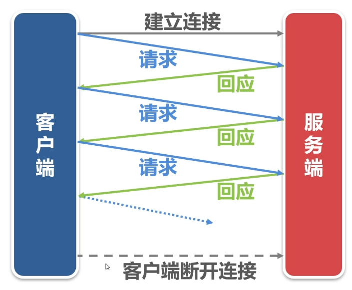
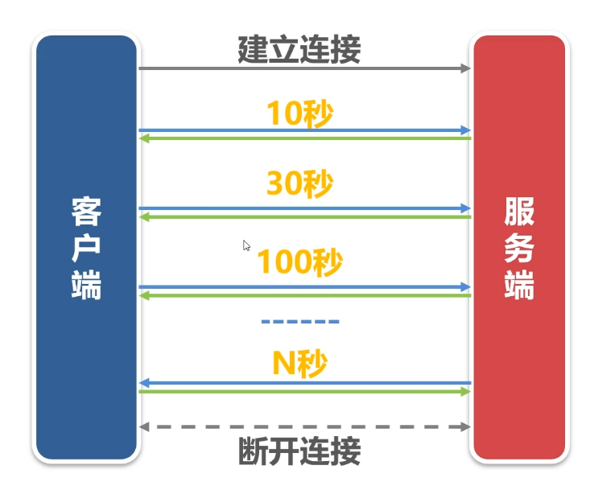

# 网络编程

## tcp长连接和短链接

TCP长连接心跳机制
服务端与客户端约定通讯的超时时间，假设为35秒
如果服务端在35秒后没有收到客户端的任何报文，则认为客户端发生了异常。
客户端如果在35秒之内没有发生任何业务，就应该向服务端发送心跳报文。

应用经验
在同一网段内部，网络设备不会断开空闲的连接
在不同的网段之间网络设备肯定会断开空心的连接，超市时间1-5分钟。
网络服务程序心跳的超时时间一般设置在50-120秒之间。