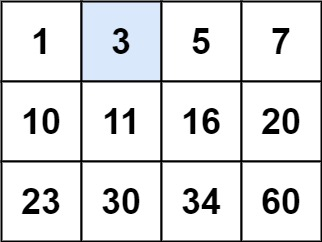
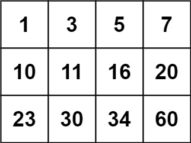

# 二分

## 33. 搜索旋转排序数组（二分）

整数数组 nums 按升序排列，数组中的值 互不相同 。
在传递给函数之前，nums 在预先未知的某个下标 k（0 <= k < nums.length）上进行了 旋转，使数组变为 [nums[k], nums[k+1], ..., nums[n-1], nums[0], nums[1], ..., nums[k-1]]（下标 从 0 开始 计数）。例如， [0,1,2,4,5,6,7] 在下标 3 处经旋转后可能变为 [4,5,6,7,0,1,2] 。
给你 旋转后 的数组 nums 和一个整数 target ，如果 nums 中存在这个目标值 target ，则返回它的下标，否则返回 -1 。

示例 1：
输入：nums = [4,5,6,7,0,1,2], target = 0
输出：4

示例 2：
输入：nums = [4,5,6,7,0,1,2], target = 3
输出：-1

示例 3：
输入：nums = [1], target = 0
输出：-1
提示：

    1 <= nums.length <= 5000
    -10^4 <= nums[i] <= 10^4
    nums 中的每个值都 独一无二
    题目数据保证 nums 在预先未知的某个下标上进行了旋转
    -10^4 <= target <= 10^4

进阶：你可以设计一个时间复杂度为 O(log n) 的解决方案吗？

```
class Solution {
public:
    int search(vector<int>& nums, int target) {
        int n = (int)nums.size();
        if (!n) {
            return -1;
        }
        if (n == 1) {
            return nums[0] == target ? 0 : -1;
        }
        int l = 0, r = n - 1;
        while (l <= r) {
            int mid = (l + r) / 2;
            if (nums[mid] == target) return mid;
            // 左边有序
            if (nums[0] <= nums[mid]) {
                if (nums[0] <= target && target < nums[mid]) {
                    r = mid - 1;
                } else {
                    l = mid + 1;
                }
                
            //右边有序
            } else {
                if (nums[mid] < target && target <= nums[n - 1]) {
                    l = mid + 1;
                } else {
                    r = mid - 1;
                }
            }
        }
        return -1;
    }
};
```

## 34. 在排序数组中查找元素的第一个和最后一个位置（二分）
给定一个按照升序排列的整数数组 nums，和一个目标值 target。找出给定目标值在数组中的开始位置和结束位置。
如果数组中不存在目标值 target，返回 [-1, -1]。

进阶：

    你可以设计并实现时间复杂度为 O(log n) 的算法解决此问题吗？
示例 1：
输入：nums = [5,7,7,8,8,10], target = 8
输出：[3,4]

示例 2：
输入：nums = [5,7,7,8,8,10], target = 6
输出：[-1,-1]

示例 3：
输入：nums = [], target = 0
输出：[-1,-1]

```
class Solution { 
public:
    int binarySearch(vector<int>& nums, int target, bool lower) {
        int left = 0, right = (int)nums.size() - 1, ans = (int)nums.size();
        while (left <= right) {
            int mid = (left + right) / 2;
            if (nums[mid] > target || (lower && nums[mid] >= target)) {
                right = mid - 1;
                ans = mid;
            } else {
                left = mid + 1;
            }
        }
        return ans;
    }

    vector<int> searchRange(vector<int>& nums, int target) {
        int leftIdx = binarySearch(nums, target, true);
        int rightIdx = binarySearch(nums, target, false) - 1;
        if (leftIdx <= rightIdx && rightIdx < nums.size() && nums[leftIdx] == target && nums[rightIdx] == target) {
            return vector<int>{leftIdx, rightIdx};
        } 
        return vector<int>{-1, -1};
    }
};
```

## 35. 搜索插入位置（二分）
给定一个排序数组和一个目标值，在数组中找到目标值，并返回其索引。如果目标值不存在于数组中，返回它将会被按顺序插入的位置。
请必须使用时间复杂度为 O(log n) 的算法。

示例 1:
输入: nums = [1,3,5,6], target = 5
输出: 2

示例 2:
输入: nums = [1,3,5,6], target = 2
输出: 1

示例 3:
输入: nums = [1,3,5,6], target = 7
输出: 4

示例 4:
输入: nums = [1,3,5,6], target = 0
输出: 0

示例 5:
输入: nums = [1], target = 0
输出: 0

```
class Solution {
public:
    int searchInsert(vector<int>& nums, int target) {
        int n = nums.size();
        int left = 0, right = n - 1, ans = n;
        while (left <= right) {
            int mid = ((right - left) >> 1) + left;
            if (target <= nums[mid]) {
                ans = mid;
                right = mid - 1;
            } else {
                left = mid + 1;
            }
        }
        return ans;
    }
};
```

## 74. 搜索二维矩阵(二分法)
编写一个高效的算法来判断 m x n 矩阵中，是否存在一个目标值。该矩阵具有如下特性：

    每行中的整数从左到右按升序排列。
    每行的第一个整数大于前一行的最后一个整数。

示例 1：


输入：matrix = [[1,3,5,7],[10,11,16,20],[23,30,34,60]], target = 3
输出：true

示例 2：

输入：matrix = [[1,3,5,7],[10,11,16,20],[23,30,34,60]], target = 13
输出：false

```
class Solution {
public:
    bool searchMatrix(vector<vector<int>>& matrix, int target) {
        int t = 0, b = matrix.size() - 1, l = 0, r = matrix[0].size() - 1;
        int mid;
        int raw = 0;
        while(t <= b)
        {
            mid = (t + b) / 2;
            if(target < matrix[mid][0])
            {
                b = mid - 1;
            }
            else if(target > matrix[mid][0])
            {
                raw = mid;
                t = mid + 1;
            }
            else
            {
                raw = mid;
                break;
            }
            cout<< mid<<t<<b<<' ';
        }
        while(l <= r)
        {
            mid = (l + r) / 2;
            if(target < matrix[raw][mid])
            {
                r = mid  - 1;
            }
            else if(target > matrix[raw][mid])
            {
                l = mid  + 1;
            }
            else
            {
                return true;
            }
        }
        return false;
    }
};
```