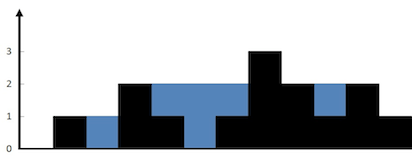

# 动态规划未分类

## 42. 接雨水（动态规划）

给定 n 个非负整数表示每个宽度为 1 的柱子的高度图，计算按此排列的柱子，下雨之后能接多少雨水。


示例1：
输入：height = [0,1,0,2,1,0,1,3,2,1,2,1]
输出：6
解释：上面是由数组 [0,1,0,2,1,0,1,3,2,1,2,1] 表示的高度图，在这种情况下，可以接 6 个单位的雨水（蓝色部分表示雨水）。 

```
// 考虑使用动态规划做记录
class Solution {
public:
    int trap(vector<int>& height) {
        int n = height.size();
        int *maxLeft = new int[n];
        int *maxRight = new int[n];
        maxLeft[0] = height[0];
        maxRight[n-1] = height[n-1];
        for(int i = 1; i < n; i++)
        {
            maxLeft[i] = max(maxLeft[i - 1], height[i]);
        }
        for(int i = n - 2; i >= 0; i--)
        {
            maxRight[i] = max(maxRight[i + 1], height[i]);
        }
        
        int ans = 0;
        for(int i = 0; i < n; i++)
        {
            ans += min(maxLeft[i], maxRight[i]) - height[i];
        }
        delete [] maxLeft;
        delete [] maxRight;
        return ans;
    }
};

```

## 45. 跳跃游戏 II(动态规划，贪心两种)
给你一个非负整数数组 nums ，你最初位于数组的第一个位置。
数组中的每个元素代表你在该位置可以跳跃的最大长度。
你的目标是使用最少的跳跃次数到达数组的最后一个位置。
假设你总是可以到达数组的最后一个位置。
示例 1:
输入: nums = [2,3,1,1,4]
输出: 2
解释: 跳到最后一个位置的最小跳跃数是 2。
     从下标为 0 跳到下标为 1 的位置，跳 1 步，然后跳 3 步到达数组的最后一个位置。

示例 2:
输入: nums = [2,3,0,1,4]
输出: 2
```
//动态规划
class Solution {
public:
    int jump(vector<int>& nums) {
        int n = nums.size();
        vector<int> dp(n);
        int start = 0;
        for(int i = 1; i<n; ++i){
            for(int j = start; j<i; ++j){
                if(j+nums[j]>=i){
                    start = j;
                    dp[i] = dp[j] + 1;
                    break;
                }
            }
        }
        return dp[n-1];
    }
};
```

```
//贪心
class Solution {
public:
    int jump(vector<int>& nums) {
        int maxPos = 0, n = nums.size(), end = 0, step = 0;
        for (int i = 0; i < n - 1; ++i) 
        {
            if (maxPos >= i) 
            {
                maxPos = max(maxPos, i + nums[i]);
                // 到达边界时，更新边界并将跳跃次数增加 1
                if (i == end) 
                {
                    end = maxPos;
                    ++step;
                }
            }
        }
        return step;
    }
};
```


## 53. 最大子数组和（动态规划，返回dp数组的最大值）
给你一个整数数组 nums ，请你找出一个具有最大和的连续子数组（子数组最少包含一个元素），返回其最大和。
子数组 是数组中的一个连续部分。

示例 1：
输入：nums = [-2,1,-3,4,-1,2,1,-5,4]
输出：6
解释：连续子数组 [4,-1,2,1] 的和最大，为 6 。

示例 2：
输入：nums = [1]
输出：1

示例 3：
输入：nums = [5,4,-1,7,8]
输出：23

```
class Solution {
public:
    int maxSubArray(vector<int>& nums) {
        if (nums.size() == 0) return 0;
        vector<int> dp(nums.size());
        dp[0] = nums[0];
        int result = dp[0];
        for (int i = 1; i < nums.size(); i++) {
            dp[i] = max(dp[i - 1] + nums[i], nums[i]); // 状态转移公式
            if (dp[i] > result) result = dp[i]; // result 保存dp[i]的最大值
        }
        return result;
    }
};
```

## 63. 不同路径 II （动态规划）
一个机器人位于一个 m x n 网格的左上角 （起始点在下图中标记为 “Start” ）。
机器人每次只能向下或者向右移动一步。机器人试图达到网格的右下角（在下图中标记为 “Finish”）。
现在考虑网格中有障碍物。那么从左上角到右下角将会有多少条不同的路径？
网格中的障碍物和空位置分别用 1 和 0 来表示。

示例 1：

输入：obstacleGrid = [[0,0,0],[0,1,0],[0,0,0]]
输出：2
解释：3x3 网格的正中间有一个障碍物。
从左上角到右下角一共有 2 条不同的路径：
1. 向右 -> 向右 -> 向下 -> 向下
2. 向下 -> 向下 -> 向右 -> 向右

示例 2：

输入：obstacleGrid = [[0,1],[0,0]]
输出：1

```
class Solution {
public:
    int uniquePathsWithObstacles(vector<vector<int>>& obstacleGrid) {
        vector<vector<int>> dp(obstacleGrid.size(), vector<int> (obstacleGrid[0].size(), 0));
        dp[0][0] = obstacleGrid[0][0] == 0 ? 1 : 0;
        for(int i = 1; i < obstacleGrid.size(); i++)
        {
            if(obstacleGrid[i][0] == 0) dp[i][0] = dp[i - 1][0];
        }
        for(int i = 1; i < obstacleGrid[0].size(); i++)
        {
            if(obstacleGrid[0][i] == 0) dp[0][i] = dp[0][i - 1];
        }
        for(int i = 1; i < obstacleGrid.size(); i++)
        {
            for(int j = 1; j < obstacleGrid[0].size(); j++)
            {
                if(obstacleGrid[i][j] == 0)
                {
                    dp[i][j] = dp[i - 1][j] + dp[i][j - 1];
                }
            }
        }
        return dp[obstacleGrid.size() - 1][obstacleGrid[0].size() - 1];
    }
};
```
滚动数组思想优化空间

```
class Solution {
public:
    int uniquePathsWithObstacles(vector<vector<int>>& obstacleGrid) {
        int n = obstacleGrid.size(), m = obstacleGrid.at(0).size();
        vector <int> f(m);

        f[0] = (obstacleGrid[0][0] == 0);
        for (int i = 0; i < n; ++i) {
            for (int j = 0; j < m; ++j) {
                if (obstacleGrid[i][j] == 1) {
                    f[j] = 0;
                    continue;
                }
                if (j - 1 >= 0 && obstacleGrid[i][j - 1] == 0) {
                    f[j] += f[j - 1];
                }
            }
        }

        return f.back();
    }
};

作者：LeetCode-Solution
链接：https://leetcode-cn.com/problems/unique-paths-ii/solution/bu-tong-lu-jing-ii-by-leetcode-solution-2/
来源：力扣（LeetCode）
著作权归作者所有。商业转载请联系作者获得授权，非商业转载请注明出处。
```
也可以直接使用原地址。

## 64.最小路径和（动态规划）
给定一个包含非负整数的 m x n 网格 grid ，请找出一条从左上角到右下角的路径，使得路径上的数字总和为最小。

说明：每次只能向下或者向右移动一步。
示例 1：

输入：grid = [[1,3,1],[1,5,1],[4,2,1]]
输出：7
解释：因为路径 1→3→1→1→1 的总和最小。

示例 2：
输入：grid = [[1,2,3],[4,5,6]]
输出：12
```

class Solution {
public:
    int minPathSum(vector<vector<int>>& grid)
    {
        int m = grid.size(), n = grid[0].size();
        vector<vector<int>> dp(m, vector<int>(m, 0));
        
        dp[0][0] = grid[0][0];
        for(int i = 1; i < m; i++) {dp[i][0] = dp[i - 1][0] + grid[i][0];}
        for(int i = 1; i < n; i++) {dp[0][i] = dp[0][i - 1] + grid[0][i];}
        for(int i = 1; i < m; i++)
        {
            for(int j = 1; j < n; j++)
            {
                dp[i][j] = min(dp[i - 1][j], dp[i][j - 1]) + grid[i][j];
            }
        }
        
        return dp[n - 1][m - 1];
    }
};
```