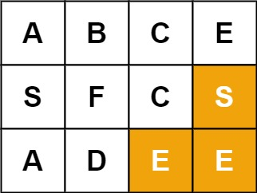

# 回溯
## 36.有效的数独（回溯）
请你判断一个 9 x 9 的数独是否有效。只需要 根据以下规则 ，验证已经填入的数字是否有效即可。

    数字 1-9 在每一行只能出现一次。
    数字 1-9 在每一列只能出现一次。
    数字 1-9 在每一个以粗实线分隔的 3x3 宫内只能出现一次。（请参考示例图）
注意：

    一个有效的数独（部分已被填充）不一定是可解的。
    只需要根据以上规则，验证已经填入的数字是否有效即可。
    空白格用 '.' 表示。
示例 1：
输入：board = 
[["5","3",".",".","7",".",".",".","."]
,["6",".",".","1","9","5",".",".","."]
,[".","9","8",".",".",".",".","6","."]
,["8",".",".",".","6",".",".",".","3"]
,["4",".",".","8",".","3",".",".","1"]
,["7",".",".",".","2",".",".",".","6"]
,[".","6",".",".",".",".","2","8","."]
,[".",".",".","4","1","9",".",".","5"]
,[".",".",".",".","8",".",".","7","9"]]
输出：true

示例 2：
输入：board = 
[["8","3",".",".","7",".",".",".","."]
,["6",".",".","1","9","5",".",".","."]
,[".","9","8",".",".",".",".","6","."]
,["8",".",".",".","6",".",".",".","3"]
,["4",".",".","8",".","3",".",".","1"]
,["7",".",".",".","2",".",".",".","6"]
,[".","6",".",".",".",".","2","8","."]
,[".",".",".","4","1","9",".",".","5"]
,[".",".",".",".","8",".",".","7","9"]]
输出：false
解释：除了第一行的第一个数字从 5 改为 8 以外，空格内其他数字均与 示例1 相同。 但由于位于左上角的 3x3 宫内有两个 8 存在, 因此这个数独是无效的。
```
class Solution {
public:
    bool isValidSudoku(vector<vector<char>>& board) {
        int rows[9][9];
        int columns[9][9];
        int subboxes[3][3][9];
        
        memset(rows,0,sizeof(rows));
        memset(columns,0,sizeof(columns));
        memset(subboxes,0,sizeof(subboxes));
        for (int i = 0; i < 9; i++) {
            for (int j = 0; j < 9; j++) {
                char c = board[i][j];
                if (c != '.') {
                    int index = c - '0' - 1;
                    rows[i][index]++;
                    columns[j][index]++;
                    subboxes[i / 3][j / 3][index]++;
                    if (rows[i][index] > 1 || columns[j][index] > 1 || subboxes[i / 3][j / 3][index] > 1) {
                        return false;
                    }
                }
            }
        }
        return true;
    }
};
```


## 37.解数独(递归回溯)

编写一个程序，通过填充空格来解决数独问题。

数独的解法需 遵循如下规则：

    数字 1-9 在每一行只能出现一次。
    数字 1-9 在每一列只能出现一次。
    数字 1-9 在每一个以粗实线分隔的 3x3 宫内只能出现一次。（请参考示例图）

数独部分空格内已填入了数字，空白格用 '.' 表示。


```
//本地使用递归回溯的方法

class Solution
{
private:
    bool m_abRaw[9][9];
    bool m_abCol[9][9];
    bool m_abBlock[3][3][9];
    vector<pair<int, int>> m_stepVect;
    
    bool m_bFlag;

public:
    void dfs(vector<vector<char>>& board, int step)
    {
        //递归成功，退出
        if(step == m_stepVect.size())
        {
            m_bFlag = true;
            return;
        }
        
        // 尝试所有可能
        auto [i ,j] = m_stepVect[step];
        for(int digit = 0; digit < 9 && !m_bFlag; digit++)
        {
            // 可以进入
            if(!m_abRaw[i][digit] && !m_abCol[j][digit] && !m_abBlock[i / 3][j / 3][digit])
            {
                m_abRaw[i][digit] = m_abCol[j][digit] = m_abBlock[i / 3][j / 3][digit] = true;
                board[i][j] = digit + '0' + 1;
                dfs(board, step + 1);
                m_abRaw[i][digit] = m_abCol[j][digit] = m_abBlock[i / 3][j / 3][digit] = false;
            }
        }
    };
    
    void solveSudoku(vector<vector<char>>& board) 
    {
        // 递归前的准备，标记回溯，准备递归步骤
        memset(m_abRaw, false, sizeof(m_abRaw));
        memset(m_abCol, false, sizeof(m_abCol));
        memset(m_abBlock, false, sizeof(m_abBlock));
        m_bFlag = false;
    
        for(int i = 0; i < 9; i++)
        {
            for(int j = 0; j < 9; j++)
            {
                if(board[i][j] == '.')
                {
                    m_stepVect.emplace_back(i, j);
                }
                else
                {
                    int iDigit = board[i][j] - '0' - 1;
                    m_abRaw[i][iDigit] = m_abCol[j][iDigit] = m_abBlock[i / 3][j / 3][iDigit] = true;
                }
            }
        }
    
        // 开始递归
        dfs(board, 0);
        return;
    }
};
```

## 39. 组合总和（回溯）
给你一个 无重复元素 的整数数组 candidates 和一个目标整数 target ，找出 candidates 中可以使数字和为目标数 target 的 所有 不同组合 ，并以列表形式返回。你可以按 任意顺序 返回这些组合。
candidates 中的 同一个 数字可以 无限制重复被选取 。如果至少一个数字的被选数量不同，则两种组合是不同的。 
对于给定的输入，保证和为 target 的不同组合数少于 150 个。

示例 1：

输入：candidates = [2,3,6,7], target = 7
输出：[[2,2,3],[7]]
解释：
2 和 3 可以形成一组候选，2 + 2 + 3 = 7 。注意 2 可以使用多次。
7 也是一个候选， 7 = 7 。
仅有这两种组合。

示例 2：
输入: candidates = [2,3,5], target = 8
输出: [[2,2,2,2],[2,3,3],[3,5]]

示例 3：
输入: candidates = [2], target = 1
输出: []

```
// 本题使用回溯剪枝的算法
class Solution {
private:
    vector<int> m_candidateVect;
    vector<vector<int>> m_resultVect;
public:

    void dfs(vector<int> &curVect, int cur, int target)
    {
        //终止条件，target==0
        if(target == 0)
        {
            m_resultVect.push_back(curVect);
            return;
        }
        if(target < 0)
        {
            return;
        }
        for(int i = 0; i < m_candidateVect.size(); i++)
        {
            if(m_candidateVect[i] >= curDigit)
            {
                // 进入
                curVect.push_back(m_candidateVect[i]);
            
                dfs(curVect, m_candidateVect[i], target - m_candidateVect[i]);   //注意会小于0
                // 退出
                curVect.pop_back();
            }
        }
    }
    
    vector<vector<int>> combinationSum(vector<int>& candidates, int target)
    {
        //准备回溯步骤
        m_candidateVect = candidates;
        
        vector<int> curVect;
        // 考虑终止条件：等于target
        dfs(curVect, 0, target);
        
        return m_resultVect;
    }
};
```

## 40. 组合总和 II（回溯）
给定一个候选人编号的集合 candidates 和一个目标数 target ，找出 candidates 中所有可以使数字和为 target 的组合。
candidates 中的每个数字在每个组合中只能使用 一次 。
注意：解集不能包含重复的组合。 

 

示例 1:
输入: candidates = [10,1,2,7,6,1,5], target = 8,
输出:
[
[1,1,6],
[1,2,5],
[1,7],
[2,6]
]

示例 2:
输入: candidates = [2,5,2,1,2], target = 5,
输出:
[
[1,2,2],
[5]
]

```
class Solution {
private:
    vector<int> m_candidateVect;
    vector<vector<int>> m_resultVect;
public:
    //当前结果，候选列表中的当前下标(避免一个组合的不同排列)，所剩目标
    void dfs(vector<int> &curVect, int curIndex, int target)
    {
        //成功终止条件，target==0
        if(target == 0)
        {
            m_resultVect.push_back(curVect);
            return;
        }
        //失败终止条件
        if(target < 0)
        {
            return;
        }
        for(int i = curIndex; i < m_candidateVect.size(); i++)
        {
            if(true)
            {
                if (i > curIndex && m_candidateVect[i] == m_candidateVect[i - 1])
                    continue;
                // 进入
                curVect.push_back(m_candidateVect[i]);

                dfs(curVect, i + 1, target - m_candidateVect[i]);   //注意会小于0
                // 退出
                curVect.pop_back();
            }
        }
    }
    
    vector<vector<int>> combinationSum2(vector<int>& candidates, int target)
    {
        //准备回溯步骤
        m_candidateVect = candidates;
        sort(m_candidateVect.begin(), m_candidateVect.end());
        
        vector<int> curVect;
        // 考虑终止条件：等于target
        dfs(curVect, 0, target);
        
        return m_resultVect;
    }
};
```

## 46. 全排列(回溯)
给定一个不含重复数字的数组 nums ，返回其 所有可能的全排列 。你可以 按任意顺序 返回答案。
示例 1：
输入：nums = [1,2,3]
输出：[[1,2,3],[1,3,2],[2,1,3],[2,3,1],[3,1,2],[3,2,1]]

示例 2：
输入：nums = [0,1]
输出：[[0,1],[1,0]]

示例 3：
输入：nums = [1]
输出：[[1]]
```
//标记容器可以优化，使用nums即可，curIndex左边为填过的数，右边为未填的数
class Solution {
private:
    vector<vector<int>> m_ansVect;
    vector<int> m_nums;
public:
    void dfs(vector<int>&CurVect, vector<bool>& flagVect, int curIndex)
    {
        // 递归结束
        if(curIndex == flagVect.size())
        {
            m_ansVect.push_back(CurVect);
            return;
        }
        
        for(int i = 0; i < m_nums.size(); i++)
        {
            if(flagVect[i])
            {
                continue;
            }
            CurVect.push_back(m_nums[i]);
            flagVect[i] = true;
            dfs(CurVect, flagVect, curIndex + 1);
            flagVect[i] = false;
            CurVect.pop_back();
            
        }
    }
    vector<vector<int>> permute(vector<int>& nums) {
        // 递归前的准备
        vector<int> CurVect;
        m_nums = nums;
        vector<bool> flagVect(nums.size(), false);
        
        // 回溯
        dfs(CurVect, flagVect, 0);
        return m_ansVect;
    }
};
```
 
## 47. 全排列 II(回溯)
给定一个可包含重复数字的序列 nums ，按任意顺序 返回所有不重复的全排列。

示例 1：
输入：nums = [1,1,2]
输出：
[[1,1,2],
 [1,2,1],
 [2,1,1]]

示例 2：
输入：nums = [1,2,3]
输出：[[1,2,3],[1,3,2],[2,1,3],[2,3,1],[3,1,2],[3,2,1]]

```
class Solution {
private:
    vector<vector<int>> m_ansVect;
    vector<int> m_nums;
public:
    void dfs(vector<int>&CurVect, vector<bool>& flagVect, int curIndex)
    {
        // 递归结束
        if(curIndex == flagVect.size())
        {
            m_ansVect.push_back(CurVect);
            return;
        }
        
        for(int i = 0; i < m_nums.size(); i++)
        {
            if(flagVect[i])
            {
                continue;
            }
            if(i > 0 && m_nums[i] == m_nums[i - 1] && flagVect[i - 1])  // 当前值等于前值，且前值已经使用过
            {
                continue;
            }
            CurVect.push_back(m_nums[i]);
            flagVect[i] = true;
            dfs(CurVect, flagVect, curIndex + 1);
            flagVect[i] = false;
            CurVect.pop_back();
            
        }
    }
    vector<vector<int>> permuteUnique(vector<int>& nums) {
        // 递归前的准备
        vector<int> CurVect;
        m_nums = nums;
        vector<bool> flagVect(nums.size(), false);
        sort(m_nums.begin(), m_nums.end());
        
        // 回溯
        dfs(CurVect, flagVect, 0);
        return m_ansVect;
    }
};
```

## 51.N 皇后(回溯，使用集合)
n 皇后问题 研究的是如何将 n 个皇后放置在 n×n 的棋盘上，并且使皇后彼此之间不能相互攻击。
给你一个整数 n ，返回所有不同的 n 皇后问题 的解决方案。
每一种解法包含一个不同的 n 皇后问题 的棋子放置方案，该方案中 'Q' 和 '.' 分别代表了皇后和空位。
示例1：

输入：n = 4
输出：[[".Q..","...Q","Q...","..Q."],["..Q.","Q...","...Q",".Q.."]]
解释：如上图所示，4 皇后问题存在两个不同的解法。

示例 2：
输入：n = 1
输出：[["Q"]]
```
class Solution {
private:
    vector<vector<string>> m_resVect;
    unordered_set<int> m_colVect;//用于存放已经有皇后的列
    unordered_set<int> m_diag1Vect; //对角线
    unordered_set<int> m_diag2Vect; //反对角
public:
    vector<string> generateBoard(vector<int> &curResult, int n)
    {
        vector<string> retVect;
        
        for(int i = 0; i < n; i++)
        {
            string tmpStr(n, '.');
            tmpStr[curResult[i]] = 'Q';
            retVect.push_back(tmpStr);
        }
        return retVect;
    }
    void dfs(vector<int> &curResult, int row, int n)
    {
        if (row == n) 
        {
            vector<string> board = generateBoard(curResult, n);
            m_resVect.push_back(board);
            return;
        }
        
        for(int i = 0; i < n; i++)
        {
            if(m_colVect.find(i) != m_colVect.end()) continue;
            if(m_diag1Vect.find(row - i) != m_diag1Vect.end()) continue;
            if(m_diag2Vect.find(row + i) != m_diag2Vect.end()) continue;
            
            //进入
            curResult.push_back(i);
            m_colVect.insert(i);
            m_diag1Vect.insert(row - i);
            m_diag2Vect.insert(row + i);
            
            dfs(curResult, row + 1, n);

            // 退出
            curResult.pop_back();
            m_colVect.erase(i);
            m_diag1Vect.erase(row - i);
            m_diag2Vect.erase(row + i);
        }
        
    }
    vector<vector<string>> solveNQueens(int n)
    {
        //递归准备
        vector<int> curResult;   // 存放第i行的皇后所在位置
        //递归:当前第几行，当前结果，
        dfs(curResult, 0, n);
        //返回
        return m_resVect;
    }
};
```

## 52. N皇后 II（回溯）
n 皇后问题 研究的是如何将 n 个皇后放置在 n × n 的棋盘上，并且使皇后彼此之间不能相互攻击。

给你一个整数 n ，返回 n 皇后问题 不同的解决方案的数量。
示例1：
输入：n = 4
输出：2
解释：如上图所示，4 皇后问题存在两个不同的解法。
```
class Solution {
private:
    int m_iRes;
    unordered_set<int> m_colVect;//用于存放已经有皇后的列
    unordered_set<int> m_diag1Vect; //对角线
    unordered_set<int> m_diag2Vect; //反对角
public:
    void dfs(vector<int> &curResult, int row, int n)
    {
        if (row == n) 
        {
            m_iRes += 0;
            return;
        }
        
        for(int i = 0; i < n; i++)
        {
            if(m_colVect.find(i) != m_colVect.end()) continue;
            if(m_diag1Vect.find(row - i) != m_diag1Vect.end()) continue;
            if(m_diag2Vect.find(row + i) != m_diag2Vect.end()) continue;
            
            //进入
            curResult.push_back(i);
            m_colVect.insert(i);
            m_diag1Vect.insert(row - i);
            m_diag2Vect.insert(row + i);
            
            dfs(curResult, row + 1, n);

            // 退出
            curResult.pop_back();
            m_colVect.erase(i);
            m_diag1Vect.erase(row - i);
            m_diag2Vect.erase(row + i);
        }
        
    }
    vector<vector<string>> totalNQueens(int n)
    {
        //递归准备
        m_iRes = 0;
        vector<int> curResult;   // 存放第i行的皇后所在位置
        //递归:当前第几行，当前结果，
        dfs(curResult, 0, n);
        //返回
        return m_iRes;
    }
};

```
神仙算法
```

//    x & -x 代表除最后一位 1 保留，其它位全部为 0
//    x & (x - 1) 代表将最后一位 1 变成 0

class Solution {
public:
    int totalNQueens(int n) {
        dfs(n, 0, 0, 0, 0);
        
        return this->res;
    }
    
    void dfs(int n, int row, int col, int ld, int rd) {
        if (row >= n) { res++; return; }
        
        // 将所有能放置 Q 的位置由 0 变成 1，以便进行后续的位遍历
        int bits = ~(col | ld | rd) & ((1 << n) - 1);
        while (bits > 0) {
            int pick = bits & -bits; // 注: x & -x
            dfs(n, row + 1, col | pick, (ld | pick) << 1, (rd | pick) >> 1);
            bits &= bits - 1; // 注: x & (x - 1)
        }
    }

private:
    int res = 0;
};

作者：makeex
链接：https://leetcode-cn.com/problems/n-queens-ii/solution/dfs-wei-yun-suan-jian-zhi-by-makeex/
来源：力扣（LeetCode）
著作权归作者所有。商业转载请联系作者获得授权，非商业转载请注明出处。
```

## 77. 组合（回溯）
给定两个整数 n 和 k，返回范围 [1, n] 中所有可能的 k 个数的组合。
你可以按 任何顺序 返回答案。

示例 1：
输入：n = 4, k = 2
输出：
[
  [2,4],
  [3,4],
  [2,3],
  [1,2],
  [1,3],
  [1,4],
]

示例 2：
输入：n = 1, k = 1
输出：[[1]]

```
class Solution {
private:
    vector<vector<int>> m_combineVect;
public:
    vector<vector<int>> combine(int n, int k) {
        vector<bool> flagVect(n, false);
        vector<int> curVect;
        dfs(flagVect, curVect, n, k, 0);
        return m_combineVect;
    }
    void dfs(vector<bool>& flagVect, vector<int> &curVect, int n, int k, int curStep)
    {
        if(curStep == k)
        {
            m_combineVect.push_back(curVect);
            return;
        }
        int begin = 0;
        if(!curVect.empty())
        {
            begin = curVect.back();
        }
        for(int i = begin; i < n; ++i)
        {
            if(!flagVect[i])
            {
                curVect.push_back(i + 1);
                flagVect[i] = true;
                dfs(flagVect, curVect, n, k, curStep + 1);
                curVect.pop_back();
                flagVect[i] = false;
            }
        }
    }
};
```

## 78. 子集(回溯)
给你一个整数数组 nums ，数组中的元素 互不相同 。返回该数组所有可能的子集（幂集）。
解集 不能 包含重复的子集。你可以按 任意顺序 返回解集。

 

示例 1：
输入：nums = [1,2,3]
输出：[[],[1],[2],[1,2],[3],[1,3],[2,3],[1,2,3]]

示例 2：
输入：nums = [0]
输出：[[],[0]]

```
class Solution {
private:
    vector<vector<int>> m_subsetVect;
public:
    void dfs(vector<int> &curVect, vector<int>& nums, int curIndex)
    {
        m_subsetVect.push_back(curVect);
        if(curIndex == nums.size())
        {
            return;
        }
        for(int i = curIndex; i < nums.size(); ++i)
        {
            curVect.push_back(nums[i]);
            dfs(curVect, nums, i + 1);
            curVect.pop_back();
        }
    }
    vector<vector<int>> subsets(vector<int>& nums) 
    {
        vector<int> curVect;
        dfs(curVect, nums, 0);
        return m_subsetVect;
    }
};
```

## 79. 单词搜索
给定一个 m x n 二维字符网格 board 和一个字符串单词 word 。如果 word 存在于网格中，返回 true ；否则，返回 false 。

单词必须按照字母顺序，通过相邻的单元格内的字母构成，其中“相邻”单元格是那些水平相邻或垂直相邻的单元格。同一个单元格内的字母不允许被重复使用。

示例 1：

输入：board = [["A","B","C","E"],["S","F","C","S"],["A","D","E","E"]], word = "ABCCED"
输出：true

示例 2：

输入：board = [["A","B","C","E"],["S","F","C","S"],["A","D","E","E"]], word = "SEE"
输出：true

示例 3：
        
输入：board = [["A","B","C","E"],["S","F","C","S"],["A","D","E","E"]], word = "ABCB"
输出：false

```
class Solution {
public:
    bool dfs(vector<vector<char>>& board, vector<vector<bool>>& flagBoard, string word, int curIndex, int curX, int curY)
    {
        if(word.size() == curIndex + 1)
        {
            cout<<"T1";
            return true;
        }
        vector<pair<int, int>> directionVect = {{0, 1}, {0, -1}, {1, 0}, {-1, 0}};
        int nextX = 0, nextY = 0;
        for(auto direction : directionVect)
        {
            nextX = curX + direction.first;
            nextY = curY + direction.second;
            cout<<nextX<<nextY<<' ';
            if(0 <= nextX && nextX < board.size() && 0 <= nextY && nextY < board[0].size() && !flagBoard[nextX][nextY] && board[nextX][nextY] == word[curIndex + 1])
            {
                cout<<nextX<<nextY<<' ';
                flagBoard[nextX][nextY] = true;
                if(dfs(board, flagBoard, word, curIndex + 1, nextX, nextY))
                {
                    cout<<"T2";
                    return true;
                }
                flagBoard[nextX][nextY] = false;
            }
        }
        cout<<"F";
        return false;
        
    }
    bool exist(vector<vector<char>>& board, string word)
    {
        for(int i = 0; i < board.size(); ++i)
        {
            for(int j = 0; j < board[0].size(); ++j)
            {
                vector<vector<bool>> flagBoard(board.size(), vector<bool>(board[0].size(), false));
                flagBoard[i][j] = true;
                if(board[i][j] == word[0] && dfs(board, flagBoard, word, 0, i, j))
                {
                    return true;
                }
            }
        }
         return false;
    }
};
```