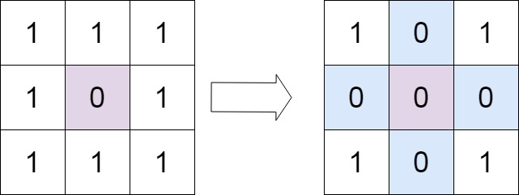
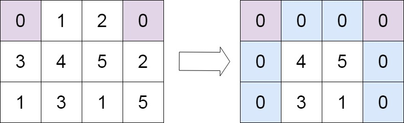

# 模拟过程

## 48. 旋转图像（模拟过程）
给定一个 n × n 的二维矩阵 matrix 表示一个图像。请你将图像顺时针旋转 90 度。
你必须在 原地 旋转图像，这意味着你需要直接修改输入的二维矩阵。请不要 使用另一个矩阵来旋转图像。


```
class Solution {
public:
    void rotate(vector<vector<int>>& matrix) {
       int temp = 0;
       int n = matrix.size();
       for(int i = 0; i < matrix.size()/2; i++)
       {
           for(int j = 0; j < (matrix.size() + 1)/2; j++)
           {
               temp = matrix[n-1-j][i];
               matrix[n-1-j][i] = matrix[n-1-i][n-1-j];
               matrix[n-1-i][n-1-j] = matrix[j][n-1-i];
               matrix[j][n-1-i] = matrix[i][j];
               matrix[i][j] = temp;
           }
       }
    }
};
```

## 54. 螺旋矩阵（模拟）
给你一个 m 行 n 列的矩阵 matrix ，请按照 顺时针螺旋顺序 ，返回矩阵中的所有元素。
示例 1：
输入：matrix = [[1,2,3],[4,5,6],[7,8,9]]
输出：[1,2,3,6,9,8,7,4,5]

示例 2：
输入：matrix = [[1,2,3,4],[5,6,7,8],[9,10,11,12]]
输出：[1,2,3,4,8,12,11,10,9,5,6,7]


```
class Solution {
private:
    static constexpr int directions[4][2] = {{0, 1}, {1, 0}, {0, -1}, {-1, 0}};
public:
    vector<int> spiralOrder(vector<vector<int>>& matrix) {
        if (matrix.size() == 0 || matrix[0].size() == 0) {
            return {};
        }
        
        int rows = matrix.size(), columns = matrix[0].size();
        vector<vector<bool>> visited(rows, vector<bool>(columns));
        int total = rows * columns;
        vector<int> order(total);

        int row = 0, column = 0;
        int directionIndex = 0;
        for (int i = 0; i < total; i++) {
            order[i] = matrix[row][column];
            visited[row][column] = true;
            int nextRow = row + directions[directionIndex][0], nextColumn = column + directions[directionIndex][1];
            if (nextRow < 0 || nextRow >= rows || nextColumn < 0 || nextColumn >= columns || visited[nextRow][nextColumn]) {
                directionIndex = (directionIndex + 1) % 4;
            }
            row += directions[directionIndex][0];
            column += directions[directionIndex][1];
        }
        return order;
    }
};
```
方法2
```
class Solution {
public:
    vector<int> spiralOrder(vector<vector<int>>& matrix) {
        vector <int> ans;
        if(matrix.empty()) return ans; //若数组为空，直接返回答案
        int u = 0; //赋值上下左右边界
        int d = matrix.size() - 1;
        int l = 0;
        int r = matrix[0].size() - 1;
        while(true)
        {
            for(int i = l; i <= r; ++i) ans.push_back(matrix[u][i]); //向右移动直到最右
            if(++ u > d) break; //重新设定上边界，若上边界大于下边界，则遍历遍历完成，下同
            for(int i = u; i <= d; ++i) ans.push_back(matrix[i][r]); //向下
            if(-- r < l) break; //重新设定有边界
            for(int i = r; i >= l; --i) ans.push_back(matrix[d][i]); //向左
            if(-- d < u) break; //重新设定下边界
            for(int i = d; i >= u; --i) ans.push_back(matrix[i][l]); //向上
            if(++ l > r) break; //重新设定左边界
        }
        return ans;
    }
};

```

## 56. 合并区间（模拟）

以数组 intervals 表示若干个区间的集合，其中单个区间为 intervals[i] = [starti, endi] 。请你合并所有重叠的区间，并返回 一个不重叠的区间数组，该数组需恰好覆盖输入中的所有区间 。

示例 1：
输入：intervals = [[1,3],[2,6],[8,10],[15,18]]
输出：[[1,6],[8,10],[15,18]]
解释：区间 [1,3] 和 [2,6] 重叠, 将它们合并为 [1,6].

示例 2：
输入：intervals = [[1,4],[4,5]]
输出：[[1,5]]
解释：区间 [1,4] 和 [4,5] 可被视为重叠区间。

```
class Solution {
public:
    vector<vector<int>> merge(vector<vector<int>>& intervals) {
        //区间左端点是否递增呢?不保证！
        //先排序
        int n = intervals.size();
        std::sort(intervals.begin(), intervals.end(), [](vector<int>& a, vector<int>& b){ return a[0] < b[0];});
        vector<vector<int>> res;
        res.push_back(intervals[0]);
        for(int i = 1; i < n; i++)
        {
            vector<int>& top = res.back();
            vector<int>& cur = intervals[i];
            if(cur[0] > top[1])
                res.push_back(intervals[i]);
            else
                top[1] = max(top[1], cur[1]);
        }
        return res;
    }
};
```
## 57. 插入区间(模拟)
给你一个 无重叠的 ，按照区间起始端点排序的区间列表。
在列表中插入一个新的区间，你需要确保列表中的区间仍然有序且不重叠（如果有必要的话，可以合并区间）。

示例 1：
输入：intervals = [[1,3],[6,9]], newInterval = [2,5]
输出：[[1,5],[6,9]]

示例 2：
输入：intervals = [[1,2],[3,5],[6,7],[8,10],[12,16]], newInterval = [4,8]
输出：[[1,2],[3,10],[12,16]]
解释：这是因为新的区间 [4,8] 与 [3,5],[6,7],[8,10] 重叠。

示例 3：
输入：intervals = [], newInterval = [5,7]
输出：[[5,7]]

示例 4：
输入：intervals = [[1,5]], newInterval = [2,3]
输出：[[1,5]]

示例 5：
输入：intervals = [[1,5]], newInterval = [2,7]
输出：[[1,7]]

```
// 自己写的垃圾算法
class Solution {
public:
    vector<vector<int>> insert(vector<vector<int>>& intervals, vector<int>& newInterval)
    {
        vector<vector<int>> resVect;
        
        int i = 0, start = 0;
        if(intervals.empty())
        {
            resVect.push_back(newInterval);
            return resVect;
        }

        while(true)
        {
            if(i == intervals.size()) {return resVect;}
            
            if(intervals[i][1] < newInterval[0])  //不重叠
            {
                resVect.push_back(intervals[i]);
                if(i == intervals.size() - 1)
                {
                    resVect.push_back(newInterval);
                }
                i++;
            }else if(intervals[i][0] > newInterval[1])
            {
                resVect.push_back(newInterval);
                break;
            }else
            {
                vector<int> tmpVect(2);
                tmpVect[0] = min(intervals[i][0], newInterval[0]);
                tmpVect[1] = max(intervals[i][1], newInterval[1]);
                resVect.push_back(tmpVect);
                i++;
                break;
            }
            
        }
        
        for(int j = i; j < intervals.size(); j++)
        {
            
            vector<int> &bckVect = resVect.back();
            if(bckVect[1] >= intervals[j][0])
            {
                bckVect[1] = max(intervals[j][1], bckVect[1]);
            }else
            {
                resVect.push_back(intervals[j]);
            }
        }
        
        return resVect;
    }
};
```

官方答案，动态维护left right：
```
class Solution {
public:
    vector<vector<int>> insert(vector<vector<int>>& intervals, vector<int>& newInterval) {
        int left = newInterval[0];
        int right = newInterval[1];
        bool placed = false;
        vector<vector<int>> ans;
        for (const auto& interval: intervals) {
            if (interval[0] > right) {
                // 在插入区间的右侧且无交集
                if (!placed) {
                    ans.push_back({left, right});
                    placed = true;                    
                }
                ans.push_back(interval);
            }
            else if (interval[1] < left) {
                // 在插入区间的左侧且无交集
                ans.push_back(interval);
            }
            else {
                // 与插入区间有交集，计算它们的并集
                left = min(left, interval[0]);
                right = max(right, interval[1]);
            }
        }
        if (!placed) {
            ans.push_back({left, right});
        }
        return ans;
    }
};
```

## 59.螺旋矩阵 II(模拟)

给你一个正整数 n ，生成一个包含 1 到 n2 所有元素，且元素按顺时针顺序螺旋排列的 n x n 正方形矩阵 matrix 
示例 1：


输入：n = 3
输出：[[1,2,3],[8,9,4],[7,6,5]]

示例 2：

输入：n = 1
输出：[[1]]

```
class Solution {
public:
    vector<vector<int>> generateMatrix(int n)
    {
        int r = n - 1, l = 0, t = 0, b = n - 1, num = 1;
        vector<vector<int>> resVect(n, vector<int>(n, 0));
        while(true)
        {
            for(int i = l; i <= r; i++) {resVect[t][i] = num; num++;}
            if(++t > b) break;
            for(int i = t; i <= b; i++) {resVect[i][r] = num; num++;}
            if(--r < l) break;
            for(int i = r; i >= l; i--) {resVect[b][i] = num; num++;}
            if(--b < r) break;
            for(int i = b; i >= t; i--) {resVect[i][l] = num; num++;}
            if(++l > r) break;
        }
        return resVect;
    }
};
```

## 66. 加一(模拟)

给定一个由 整数 组成的 非空 数组所表示的非负整数，在该数的基础上加一。
最高位数字存放在数组的首位， 数组中每个元素只存储单个数字。
你可以假设除了整数 0 之外，这个整数不会以零开头。

示例 1：
输入：digits = [1,2,3]
输出：[1,2,4]
解释：输入数组表示数字 123。

示例 2：
输入：digits = [4,3,2,1]
输出：[4,3,2,2]
解释：输入数组表示数字 4321。

示例 3：
输入：digits = [0]
输出：[1]

```
class Solution {
public:
    vector<int> plusOne(vector<int>& digits) {
        vector<int> resVect(digits.size(), 0);
        int carry = 1;
        for(int i = digits.size() - 1; i >= 0; i--)
        {
            resVect[i] = (digits[i] + carry) % 10;
            carry = (digits[i] + carry) / 10;
        }
        if(carry == 1)
        {
            vector<int> resVect1(digits.size()  +1, 0);
            resVect1[0] = 1;
            return resVect1;
        }

        return resVect;
    }
};
```

## 73. 矩阵置零(原地算法，模拟)
给定一个 m x n 的矩阵，如果一个元素为 0 ，则将其所在行和列的所有元素都设为 0 。请使用 原地 算法。
示例 1：

输入：matrix = [[1,1,1],[1,0,1],[1,1,1]]
输出：[[1,0,1],[0,0,0],[1,0,1]]

示例 2：

输入：matrix = [[0,1,2,0],[3,4,5,2],[1,3,1,5]]
输出：[[0,0,0,0],[0,4,5,0],[0,3,1,0]]
```

class Solution {
public:
    void setZeroes(vector<vector<int>>& matrix) {
        bool bRawFlag = false;
        bool bColFlag = false;

        int m = matrix.size(), n = matrix[0].size();

        for(int i = 0; i < m; i++)
        {
            if(matrix[i][0] == 0)
            {
                //matrix[i][0] = 1;
                bColFlag = true;
            }
        }
        for(int i = 0; i < n; i++)
        {
            if(matrix[0][i] == 0)
            {
                //matrix[0][i] = 1;
                bRawFlag = true;
            }
        }
        for(int i = 1; i < m; i++)
        {
            for(int j = 1; j < n; j++)
            {
                if(matrix[i][j] == 0)
                {
                    matrix[i][0] = 0;
                    matrix[0][j] = 0;
                    cout<<i<<j<<' ';
                }
            }
        }

        for(int i = 1; i < m; i++)
        {
            if(matrix[i][0] == 0)
            {
                for(int j = 1; j < n; j++)
                {
                    matrix[i][j] = 0;
                }
            }
        }

        for(int j = 1; j < n; j++)
        {
            if(matrix[0][j] == 0)
            {
                for(int i = 1; i < m; i++)
                {
                    matrix[i][j] = 0;
                }
            }
        }

        if(bRawFlag)
        {
            for(int j = 0; j < n; j++)
            {
                matrix[0][j] = 0;
            }
        }

        if(bColFlag)
        {
            for(int i = 0; i < m; i++)
            {
                matrix[i][0] = 0;
            }
        }

    }
};
```

## 969. 煎饼排序（模拟）
给你一个整数数组 arr ，请使用 煎饼翻转 完成对数组的排序。

一次煎饼翻转的执行过程如下：

    选择一个整数 k ，1 <= k <= arr.length
    反转子数组 arr[0...k-1]（下标从 0 开始）

例如，arr = [3,2,1,4] ，选择 k = 3 进行一次煎饼翻转，反转子数组 [3,2,1] ，得到 arr = [1,2,3,4] 。

以数组形式返回能使 arr 有序的煎饼翻转操作所对应的 k 值序列。任何将数组排序且翻转次数在 10 * arr.length 范围内的有效答案都将被判断为正确。

示例1：
```
输入：[3,2,4,1]
输出：[4,2,4,3]
解释：
我们执行 4 次煎饼翻转，k 值分别为 4，2，4，和 3。
初始状态 arr = [3, 2, 4, 1]
第一次翻转后（k = 4）：arr = [1, 4, 2, 3]
第二次翻转后（k = 2）：arr = [4, 1, 2, 3]
第三次翻转后（k = 4）：arr = [3, 2, 1, 4]
第四次翻转后（k = 3）：arr = [1, 2, 3, 4]，此时已完成排序。 
```

示例 2：
```
输入：[1,2,3]
输出：[]
解释：
输入已经排序，因此不需要翻转任何内容。
请注意，其他可能的答案，如 [3，3] ，也将被判断为正确。
```

提示：

```
1 <= arr.length <= 100
1 <= arr[i] <= arr.length
arr 中的所有整数互不相同（即，arr 是从 1 到 arr.length 整数的一个排列）
```

结果：
```
class Solution {
public:
    vector<int> pancakeSort(vector<int>& arr) {
        vector<int> ret;
        for (int n = arr.size(); n > 1; n--) {
            int index = max_element(arr.begin(), arr.begin() + n) - arr.begin();
            if (index == n - 1) {
                continue;
            }
            reverse(arr.begin(), arr.begin() + index + 1);
            reverse(arr.begin(), arr.begin() + n);
            ret.push_back(index + 1);
            ret.push_back(n);
        }
        return ret;
    }
};
```
